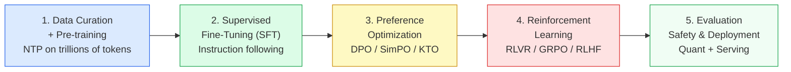

# Chapter 1: The LLM Training Landscape in 2026

> [!IMPORTANT]
> **What You Will Learn**
> - Understand the 2026 shift from parameter-count to inference-optimality.
> - Map the 5-stage modern training pipeline from pre-training to deployment.
> - Analyze Chinchilla scaling laws and how frontier labs override them in practice.
> - Estimate compute, data, and human capital costs of frontier LLM development.

---

## The Evolution of Language Model Training

Large language models have undergone a dramatic transformation. What began as research curiosities have become the computational backbone of search engines, coding assistants, data analysis platforms, and creative tools. The global market for LLMs was valued at $6.4 billion in 2024 and is projected to reach $36.1 billion by 2030.

The training paradigm has shifted substantially. Early models relied on a simple recipe: more data plus more parameters equals better performance. By late 2025, several hard constraints became apparent:

- Marginal gains from more compute diminish past the Chinchilla frontier.
- High-quality, deduplicated text is finite and increasingly expensive to acquire.
- Ever-larger models collide with real-time product requirements and energy budgets.
- Inference cost at deployment scale far exceeds the one-time training cost.

**Post-training** — the combination of supervised fine-tuning, preference optimization, and reinforcement learning — now accounts for the majority of a model's usable capability. The field has moved from *make the base model bigger* to *given a strong base model, how do we make it safe, efficient, and excellent at specific jobs?*

---

## The Modern Training Pipeline

| Stage | Purpose | Key Methods |
| :--- | :--- | :--- |
| Data curation | Build a high-quality training corpus | MinHash dedup, quality classifiers, DoReMi mixing |
| Pre-training | Learn broad world knowledge | NTP, FIM (code), curriculum learning |
| SFT | Establish instruction-following behavior | LoRA, QLoRA, DoRA, chat templates |
| Preference optimization | Align with human values | DPO, SimPO, KTO, GRPO |
| Evaluation & deployment | Ensure safety and production readiness | Benchmarks, red-teaming, quantization, vLLM |

---

## Scaling Laws and the Compute-Optimal Frontier

The **Chinchilla scaling laws** (Hoffmann et al., 2022) established that for a fixed compute budget $C$, optimal model size $N$ and training tokens $D$ satisfy:

$$N^* \propto C^{0.5}, \qquad D^* \propto C^{0.5}$$

This revealed that GPT-3 (175B params, 300B tokens) was severely undertrained. Chinchilla-70B (70B params, 1.4T tokens) outperformed GPT-3 at one-quarter the inference cost.

**The 2026 override:** Frontier labs deliberately *overtrain* smaller models relative to Chinchilla for a practical reason — inference cost at deployment scale dwarfs training cost. Llama 3.1-8B was trained on ~15T tokens (Chinchilla-optimal would be ~160B tokens) because a smaller, cheaper-to-serve model is worth extra training compute.

> [!TIP]
> **Scaling Law Implications for Practitioners**
> - At 7B parameters, Chinchilla-optimal is ~140B tokens; training on 1T+ tokens yields materially better downstream performance.
> - Emergent capabilities appear discontinuously at scale — capability predictions from smaller experiments are unreliable.
> - Data quality has a multiplicative effect: doubling data quality often beats doubling data quantity.
> - Post-training multiplies base model capability — a well-aligned 7B beats a poorly-aligned 70B on most tasks.

---

## Cost Realities

| Phase | Cost Range | Key Driver |
| :--- | :--- | :--- |
| Pre-training (frontier 1T+) | \$5M – \$100M+ | GPU cluster hours |
| Pre-training (7B–70B) | \$50K – \$5M | Data quality + GPU hours |
| Fine-tuning (LoRA/QLoRA) | \$100 – \$10K | Dataset size, GPU type |
| RLHF / DPO alignment | \$10K – \$500K | Human annotation costs |
| Evaluation & Red-teaming | \$5K – \$100K | Evaluator complexity |
| Inference infrastructure | \$1K – \$50K/month | Traffic volume, latency SLA |

> [!NOTE]
> **Hidden cost: human expertise.** The largest cost at frontier labs is not GPU hours — it is the human capital required to design training pipelines, curate data, write constitutions, and interpret evaluation results. A world-class LLM team of 10–30 engineers costs more annually than many full training runs.

---

## The Post-Training Revolution

The most important shift in 2025–2026: **post-training is now the primary source of capability differentiation** between models with similar base models.

Evidence:
- Llama 3.1-70B base vs. Llama 3.1-70B Instruct: the instruct model scores 20–40 points higher on most instruction-following benchmarks — same weights, different post-training.
- DeepSeek R1-Zero: AIME accuracy from 15.6% → 71.0% purely through RL post-training on the base model.
- Meta Llama 4: deliberately reduced SFT data volume after finding that heavy SFT *hurts* subsequent RL alignment.

This creates a new engineering discipline: **post-training engineering** — the art of designing alignment pipelines that maximally unlock base model capability.

---

[← Previous Chapter](front_matter.md) | [Table of Contents](../README.md#table-of-contents) | [Next Chapter →](ch02_architecture.md)
