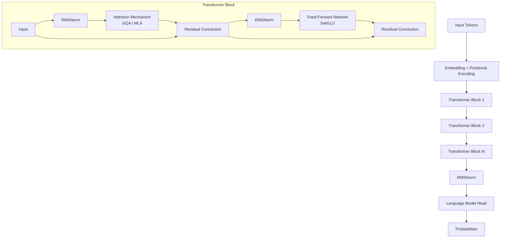
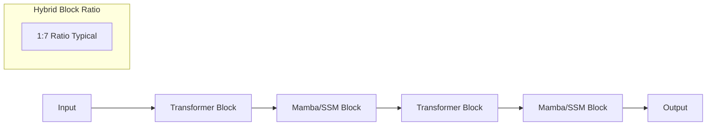

> [!IMPORTANT]
> **What You Will Learn**
> - Evaluate the decoder-only transformer and its 2026 architectural variations.
> - Analyze MQA, GQA, and MLA for efficient KV cache management at scale.
> - Evaluate the rise of Hybrid SSM-Transformer architectures (Mamba, Jamba).
> - Compare modern positional encodings including RoPE, iRoPE, and ALiBi.
> - Review production-standard normalization (RMSNorm) and activation (SwiGLU) functions.
> - Understand the 2025 transition to fine-grained Mixture of Experts (MoE).

Nearly all modern autoregressive LLMs use a decoder-only transformer architecture: sequential blocks of masked self-attention and feed-forward sub-layers. In PaLM-540B, approximately 90% of parameters reside in feed-forward layers---which is why MoE focuses on FFN efficiency.

### Architectural Comparison: Key Modern Models

| **Model** | **Params** | **Context** | **Notable Features** |
| :--- | :--- | :--- | :--- |
| Llama 3.1 (70B) | 70B | 128K | GQA, RoPE, SwiGLU |
| Mistral 7B | 7B | 32K | GQA, sliding window |
| Mixtral 8x7B | 47B total | 32K | MoE, 13B active |
| DeepSeek-V3 | 671B total | 128K | Fine-grained MoE, MLA |
| Llama 4 Maverick | 400B total | 1M | MoE, iRoPE, 128 experts |
*Table: Representative modern model architectures*

## Key Architectural Components

### Multi-Head Attention Variants

Standard multi-head attention (MHA) uses $H$ heads each with independent $Q$, $K$, $V$ projections (formulation and code: [Appendix G](app_g_implementation_treasury.md)). The KV cache grows as $2 \times H \times d_\text{head} \times L$ per token at inference---a critical bottleneck at long context.

  - **Multi-Query Attention (MQA):** Single K,V head shared by all query heads. Maximum KV cache reduction; can hurt quality at small scale (formulation: [Appendix G](app_g_implementation_treasury.md)).
  - **Grouped Query Attention (GQA):** $G$ KV head groups ($1 < G < H$) [ainslie2023gqa]. Balances cache reduction and quality. Used in Llama 3, Mistral, and most 2025 models (formulation and code: [Appendix G](app_g_implementation_treasury.md)).
  - **Multi-head Latent Attention (MLA):** DeepSeek-V3. KV cache is compressed into a low-rank latent vector $c_{KV}$, from which heads are projected via an up-projection matrix $W_{UK}$. This achieves the memory footprint of MQA while maintaining the expressive power of MHA (formulation and code: [Appendix G](app_g_implementation_treasury.md)).

> **MLA Mechanics**
>
> MLA's core innovation is the decoupled latent vector:
> $$

> c_{KV} = W_{DK} h_t, \quad k_t, v_t = W_{UK} c_{KV}
> $$

> where $W_{DK}$ is a down-projection and $W_{UK}$ an up-projection. RoPE is applied to a separate, non-compressed portion of the query and key to maintain relative position awareness without bloating the KV cache.

## Post-Transformer & Hybrid Architectures

While the Transformer remains dominant, 2025-2026 has seen the maturation of **State Space Models (SSMs)** and **Hybrid** architectures that challenge the quadratic complexity of attention.

### Mamba and the Selective Scan

Mamba [gu2023mamba] replaces the attention mechanism with a **Selective State Space Model**. Unlike Transformers, which attend to the entire history (quadratic cost), Mamba compresses the history into a fixed-size latent state (linear cost).

- **Selective Scan:** Allows the model to decide what information to "forget" or "remember" based on the current input.
- **Inference Speed:** Up to 5x faster than Transformers at long context.
- **Memory:** Constant memory footprint during generation (no KV cache).

### Hybrid Architectures (Jamba, Bolt)

Hybrid models like **Jamba** [lieber2024jamba] combine Transformer blocks and Mamba blocks in a single architecture. This provides the "best of both worlds": the strong reasoning and in-context learning of Transformers with the efficiency and long-context performance of SSMs.

| **Architecture** | **Complexity** | **Memory (Inference)** | **Best For** |
| :--- | :--- | :--- | :--- |
| Pure Transformer | $O(n^2)$ | Linear (KV Cache) | Reasoning, Few-shot |
| Pure Mamba/SSM | $O(n)$ | Constant (Hidden State) | Extrem long context, Edge |
| Hybrid (Jamba) | $O(n)$ effective | Reduced Cache | Production Frontier 2026 |

### Positional Encodings

Full derivations in [Appendix G](app_g_implementation_treasury.md).

  - **RoPE (Rotary Position Embedding):** Applies rotation matrices to Q/K vectors [su2024roformer]. Encodes relative positions implicitly. Dominant 2025-2026 standard.
  - **iRoPE (Llama 4):** Interleaved no-position and RoPE layers. Enables 10M-token context without explicit positional interpolation.
  - **ALiBi:** Linear bias on attention scores [press2022train]. Zero extra parameters, strong length generalization.
  - **YaRN / LongRoPE:** NTK-aware RoPE interpolation for 4-8x context extension without full retraining [peng2023yarn].

### Normalization and Activation

Full formulations in [Appendix G](app_g_implementation_treasury.md) (RMSNorm, SwiGLU).

  - **RMSNorm with pre-normalization:** More stable than post-norm LayerNorm. Dominant in all major 2025 models (formulation: [Appendix G](app_g_implementation_treasury.md)).
  - **SwiGLU:** Gated FFN activation combining Swish and GLU [shazeer2020glu]. Standard for 2024-2026 (formulation: [Appendix G](app_g_implementation_treasury.md)).

| **Function** | **Formulation** | **Key Trade-off / Usage** |
| :--- | :--- | :--- |
| ReLU | $\max(0, x)$ | Simple, fast. Risk of "dying ReLU" (zero gradient). |
| GeLU | $x \Phi(x)$ | Smooth, probabilistic gating. GPT-2/3 standard. |
| Swish / SiLU | $x \sigma(x)$ | Non-monotonic, smoother than ReLU. Llama 1/2. |
| SwiGLU | $\text{Gated}(x, \text{Swish})$ | Most expressive. 2026 production standard. |
*Table: Comparative analysis of activation functions in LLMs*

## Mixture of Experts (MoE)

Replace the dense FFN with multiple smaller expert networks and a router selecting which experts process each token [shazeer2017outrageously] (formulation and code: [Appendix G](app_g_implementation_treasury.md)). Only 1-2 of 8-64 experts activate per token. Mixtral 8x7B: 47B total parameters, ~13B active per forward pass.

> **Key MoE Developments in 2025-2026**
>
> - **DeepSeekMoE [dai2024deepseekmoe]:** Fine-grained experts with shared expert isolation. 256 routed experts + 1 shared expert per layer.
> - **Sparse Upcycling:** Convert dense models to MoE without training from scratch.
>   - **SwitchHead:** MoE applied to attention projection layers (Q, K, V).
>   - **Expert Parallelism:** Distributed experts across GPUs for efficient scale.
>   - **Load Balancing:** Auxiliary loss or expert-choice routing prevents expert collapse.

## Context Length and Efficient Attention

  - **Flash Attention (v2/v3):** $O(n^2) \rightarrow O(n)$ memory via IO-aware tiling [dao2022flashattention,dao2023flashattention2,shah2024flashattention3]. Mandatory for modern training. FA3 adds warp-specialization for ~2x speedup over FA2 on H100.
  - **Ring Attention:** Million-token contexts across devices in a ring topology. Each device holds one segment; KV chunks circulate.
  - **Sliding Window Attention:** Fixed local window with cross-layer information flow (Mistral).

| **Context Window** | **KV Cache (7B)** | **Use Case** |
| :--- | :--- | :--- |
| 4K tokens | 512 MB | Short conversations |
| 32K tokens | 4 GB | Document processing |
| 128K tokens | 16 GB | Full codebase analysis |
| 1M tokens | 128 GB | Entire book corpus |
*Table: Approximate KV cache memory at different context lengths (BF16, 32 heads)*

---

[← Previous Chapter](ch01_landscape.md) | [Table of Contents](../README.md#table-of-contents) | [Next Chapter →](ch03_data_curation.md)