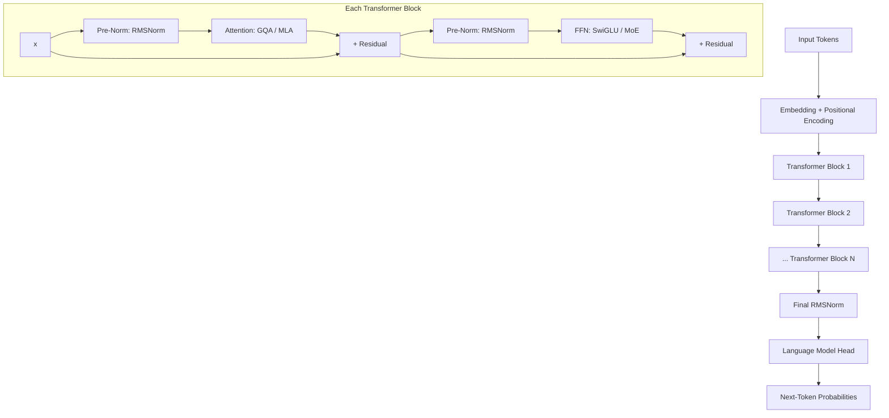
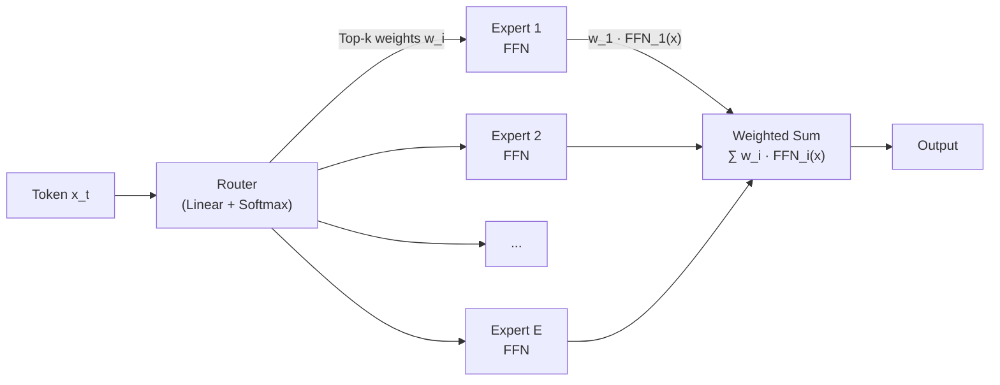
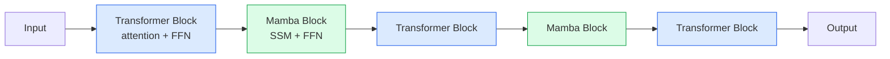

# Chapter 2: Transformer Architecture — The 2026 Production Stack

> [!IMPORTANT]
> **What You Will Learn**
> - Evaluate the decoder-only transformer and its 2026 architectural variations.
> - Analyze MQA, GQA, and MLA for efficient KV cache management at scale.
> - Evaluate the rise of Hybrid SSM-Transformer architectures (Mamba, Jamba).
> - Compare modern positional encodings including RoPE, iRoPE, and ALiBi.
> - Review production-standard normalization (RMSNorm) and activation (SwiGLU) functions.
> - Understand the 2025 transition to fine-grained Mixture of Experts (MoE).

---

Nearly all modern autoregressive LLMs use a **decoder-only transformer** architecture: sequential blocks of masked self-attention and feed-forward sub-layers. In PaLM-540B, approximately 90% of parameters reside in feed-forward layers — which is why MoE targets FFN efficiency first.

---

## Architectural Comparison: Key Modern Models

| Model | Params | Context | Notable Features |
| :--- | :--- | :--- | :--- |
| Llama 3.1 (70B) | 70B | 128K | GQA, RoPE, SwiGLU |
| Mistral 7B | 7B | 32K | GQA, sliding window attention |
| Mixtral 8x7B | 47B total | 32K | MoE (8 experts, 13B active) |
| DeepSeek-V3 | 671B total | 128K | Fine-grained MoE, MLA |
| Llama 4 Maverick | 400B total | 1M | MoE (128 experts), iRoPE |

---

## Multi-Head Attention Variants

Standard multi-head attention (MHA) uses $H$ heads each with independent $Q$, $K$, $V$ projections (see [Appendix G](app_g_implementation_treasury.md)). The KV cache grows as:

$$
\text{KV cache size} = 2 \times H \times d_{\text{head}} \times L \times \text{bytes}
$$

per token at inference — a critical bottleneck at long context lengths.

### Multi-Query Attention (MQA)

Single $K, V$ head shared by all query heads (Shazeer, 2019). Maximum KV cache reduction; can hurt quality at smaller scale.

### Grouped Query Attention (GQA)

$G$ KV head groups where $1 < G < H$ (Ainslie et al., 2023). Balances cache reduction and model quality. Used in Llama 3, Mistral, and most 2025 production models. See [Appendix G](app_g_implementation_treasury.md) for implementation.

### Multi-head Latent Attention (MLA)

DeepSeek-V3's innovation. The KV cache is compressed into a low-rank latent vector $c_{KV}$, from which heads are projected via an up-projection matrix $W_{UK}$. Achieves the memory footprint of MQA while maintaining the expressive power of MHA.

> [!NOTE]
> **MLA Core Mechanics**
>
> MLA's key innovation is the decoupled latent projection:
>
> $$c_{KV} = W_{DK}\, h_t, \qquad k_t,\, v_t = W_{UK}\, c_{KV}$$
>
> where $W_{DK}$ is a down-projection and $W_{UK}$ an up-projection. RoPE is applied to a separate, non-compressed portion of the query and key, maintaining relative position awareness without bloating the cached state.
>
> **Result:** MLA caches only $c_{KV}$ (rank $r \ll H \cdot d_\text{head}$) instead of full $K, V$ tensors — near-MQA memory with near-MHA quality.

### Attention Variant Comparison

| Variant | KV Cache | Quality | Used In |
| :--- | :--- | :--- | :--- |
| MHA | Full ($H \times d_h$) | Best | GPT-2, early models |
| MQA | Minimal ($1 \times d_h$) | Reduced | Falcon, early Mistral |
| GQA | Reduced ($G \times d_h$) | Near-MHA | Llama 3, Mistral, Qwen |
| MLA | Latent ($r \ll H \times d_h$) | Near-MHA | DeepSeek-V3, V3-R1 |

---

## Positional Encodings

Full derivations and implementations in [Appendix G](app_g_implementation_treasury.md).

### RoPE (Rotary Position Embedding)

Applies rotation matrices to $Q/K$ vectors (Su et al., 2024). Encodes relative positions implicitly — no absolute position lookup table. The dominant standard in 2025–2026.

$$q_m^\top k_n = \text{Re}\left[(W_q x_m) \odot \overline{(W_k x_n)}\right] \cdot e^{i(m-n)\theta}$$

### iRoPE (Llama 4)

Interleaves layers with no positional encoding and layers with standard RoPE. Enables 10M-token context extrapolation without explicit positional interpolation or retraining.

### ALiBi

Linear attention score bias proportional to query-key distance (Press et al., 2022). Zero extra parameters; strong length generalization beyond the training window.

### YaRN / LongRoPE

NTK-aware RoPE interpolation (Peng et al., 2023). Achieves 4–8× context extension without full retraining by rescaling the rotary frequencies.

---

## Normalization and Activation

Full formulations in [Appendix G](app_g_implementation_treasury.md).

### RMSNorm (Pre-Normalization)

More training-stable than post-norm LayerNorm. Applied *before* the attention and FFN sub-layers in all major 2025 models.

$$\text{RMSNorm}(x) = \frac{x}{\sqrt{\frac{1}{d}\sum_i x_i^2 + \epsilon}} \cdot \gamma$$

### SwiGLU Activation

Gated FFN activation combining Swish and GLU (Shazeer, 2020). More expressive than ReLU or GELU at the same parameter count. The 2024–2026 production standard.

$$\text{SwiGLU}(x, W, V) = \text{Swish}(xW) \odot (xV)$$

### Activation Function Comparison

| Function | Formulation | Notes |
| :--- | :--- | :--- |
| ReLU | $\max(0, x)$ | Simple, fast; risk of "dying ReLU" |
| GeLU | $x\,\Phi(x)$ | Smooth probabilistic gating; GPT-2/3 |
| Swish / SiLU | $x\,\sigma(x)$ | Non-monotonic; Llama 1/2 |
| **SwiGLU** | $\text{Gated}(x, \text{Swish})$ | **Most expressive; 2026 standard** |

---

## Mixture of Experts (MoE)

Replaces the dense FFN with $E$ smaller expert networks plus a learned router. Only $k$ of $E$ experts (typically $k=1$–$2$, $E=8$–$64$) activate per token. See [Appendix G](app_g_implementation_treasury.md) for formulation and code.

**Example:** Mixtral 8x7B — 47B total parameters, ~13B active per forward pass.

> [!TIP]
> **Key MoE Developments in 2025–2026**
>
> - **DeepSeekMoE** (Dai et al., 2024): Fine-grained experts with shared expert isolation. 256 routed experts + 1 always-active shared expert per layer.
> - **Sparse Upcycling**: Convert dense checkpoints to MoE without training from scratch — reuses FFN weights as initial expert weights.
> - **SwitchHead**: Applies MoE routing to attention projection layers (Q, K, V), not just FFNs.
> - **Expert Parallelism**: Distribute experts across GPUs so each GPU owns a subset of experts.
> - **Load Balancing**: Auxiliary loss or expert-choice routing prevents expert collapse (all tokens routing to one expert).

---

## Post-Transformer & Hybrid Architectures

While the Transformer remains dominant, 2025–2026 has seen the maturation of **State Space Models (SSMs)** and **Hybrid** architectures that address quadratic attention complexity.

### Mamba and the Selective Scan

Mamba (Gu & Dao, 2023) replaces attention with a **Selective State Space Model**. Unlike Transformers, which attend to the full history at $O(n^2)$ cost, Mamba compresses history into a fixed-size latent state at $O(n)$ cost.

- **Selective Scan:** The model learns input-dependent gates to decide what to remember or forget at each step.
- **Inference Speed:** Up to 5× faster than Transformers at long context lengths.
- **Memory:** Constant memory during generation — no KV cache at all.

> [!WARNING]
> Mamba trades **recall precision** for efficiency. It struggles with tasks requiring exact retrieval of specific tokens from long contexts (e.g., "find the 3rd occurrence of X"), where Transformer attention excels.

### Hybrid Architectures (Jamba, Bolt)

Hybrid models like **Jamba** (Lieber et al., 2024) interleave Transformer and Mamba blocks, combining the reasoning strength of Transformers with the long-context efficiency of SSMs.

> *Typical ratio: 1 Transformer block per 7 Mamba blocks (Jamba default)*

### Architecture Complexity Comparison

| Architecture | Attention Complexity | Inference Memory | Best For |
| :--- | :--- | :--- | :--- |
| Pure Transformer | $O(n^2)$ | Linear (KV cache grows) | Reasoning, few-shot learning |
| Pure Mamba / SSM | $O(n)$ | Constant (fixed state) | Extreme long context, edge |
| Hybrid (Jamba) | $O(n)$ effective | Reduced cache | Production frontier 2026 |

---

## Context Length and Efficient Attention

- **Flash Attention v2/v3** (Dao, 2023; Shah et al., 2024): $O(n^2) \rightarrow O(n)$ memory via IO-aware tiling. Mandatory for modern training. FA3 adds warp-specialization for ~2× throughput over FA2 on H100.
- **Ring Attention**: Distributes long sequences across devices in a ring topology. Each device holds one segment; KV chunks circulate for global attention. Enables million-token context.
- **Sliding Window Attention**: Each token attends only to a local window. Cross-layer stacking allows global information flow (Mistral, 2023).

### KV Cache Memory at Different Context Lengths

| Context Window | KV Cache (7B model) | Use Case |
| :--- | :--- | :--- |
| 4K tokens | ~512 MB | Short conversations |
| 32K tokens | ~4 GB | Document processing |
| 128K tokens | ~16 GB | Full codebase analysis |
| 1M tokens | ~128 GB | Book-length corpus |

> *Estimates: BF16 precision, 32 attention heads, 8 KV heads (GQA)*

---

## Chapter Summary

| Component | 2022 Standard | 2026 Standard | Key Benefit |
| :--- | :--- | :--- | :--- |
| Attention | MHA | GQA / MLA | 4–8× smaller KV cache |
| Position | Learned / Sinusoidal | RoPE / iRoPE | Better length generalization |
| Normalization | Post-norm LayerNorm | Pre-norm RMSNorm | Training stability |
| Activation | GELU | SwiGLU | Higher expressiveness |
| FFN | Dense | MoE (sparse) | 3–8× parameter efficiency |
| Long context | Standard attention | Flash Attention + Ring | Million-token context |

---

[← Previous Chapter](ch01_landscape.md) | [Table of Contents](../README.md#table-of-contents) | [Next Chapter →](ch03_data_curation.md)
