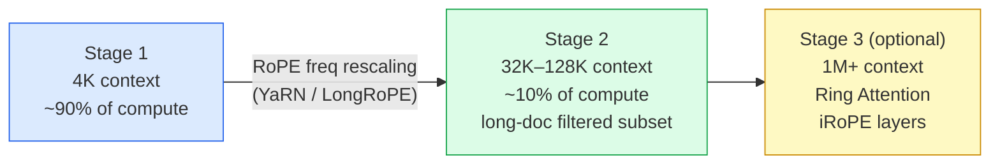

# Chapter 6: Pre-training Objectives and Strategies

> [!IMPORTANT]
> **What You Will Learn**
> - Master the next-token prediction (NTP) objective and its 2026 variants.
> - Understand Reinforcement Pre-Training (RPT) and Fill-in-the-Middle (FIM) objectives.
> - Apply curriculum learning and data mixing strategies (DoReMi).
> - Implement instruction-augmented pre-training to bridge to SFT.
> - Design a multi-stage compute-optimal context extension pipeline.

---

## Next-Token Prediction (NTP)

Self-supervised causal language modeling — the core objective for every modern autoregressive LLM. See [Appendix G](app_g_implementation_treasury.md) for the full implementation and perplexity metric.

$$\mathcal{L}_\mathrm{NTP}(\theta) = -\frac{1}{|\mathcal{D}|}\sum_{x \in \mathcal{D}}\sum_{t=1}^{T} \log p_\theta(x_t \mid x_1, \ldots, x_{t-1})$$

The model factorizes the joint distribution **autoregressively** — each token is conditioned on all preceding tokens:

$$P_\theta(x_1, \dots, x_T) = \prod_{t=1}^{T} P_\theta(x_t \mid x_{<t})$$

No labeled data is needed. Despite its simplicity, NTP is sufficient to produce emergent capabilities at scale: syntax, semantics, factual knowledge, multi-step reasoning, and in-context learning all emerge from this single objective applied to enough high-quality text.

**Perplexity** is the standard evaluation metric during pre-training:

$$\mathrm{PPL} = \exp(\mathcal{L}_\mathrm{NTP})$$

Lower perplexity = higher confidence predictions. A key property: perplexity improvements on held-out data reliably predict downstream benchmark improvements, making it the primary signal for pre-training health.

> [!NOTE]
> **Why NTP works so well.** To predict the next token accurately, a model must implicitly learn world knowledge (facts), syntax (grammar), and reasoning (multi-step inference). The objective is a proxy for compression — the best compressor of human text is also the most capable model.

---

## Compute-Optimal Training (Chinchilla Scaling)

Before choosing training duration, determine the compute-optimal allocation between model size and token count.

The Chinchilla scaling laws (Hoffmann et al., 2022) show that for a fixed compute budget $C$ (in FLOPs), optimal model size $N$ and training tokens $D$ satisfy:

$$N^* \propto C^{0.5}, \qquad D^* \propto C^{0.5}$$

This means earlier large models (GPT-3, PaLM) were systematically **undertrained** — they had too many parameters for the data they saw.

| Model | Params | Tokens | Chinchilla-Optimal? |
| :--- | :--- | :--- | :--- |
| GPT-3 | 175B | 300B | No — ~5× undertrained |
| Chinchilla | 70B | 1.4T | Yes |
| Llama 3.1 (8B) | 8B | 15T | Deliberately overtrained |
| DeepSeek-V3 | 671B (MoE) | 14.8T | Inference-optimal |

> [!TIP]
> **Inference-optimal vs. compute-optimal.** Frontier labs now deliberately train smaller models on more tokens than Chinchilla prescribes. Reason: the model is deployed at massive scale, so reducing inference cost (smaller model) is worth the extra training compute. A Chinchilla-optimal 70B model is more expensive to serve than an "overtrained" 8B model with comparable quality.

### The Scaling Law Formula

For a transformer with $N$ parameters trained on $D$ tokens, the expected cross-entropy loss decomposes into three additive terms:

$$L(N, D) = \frac{A}{N^\alpha} + \frac{B}{D^\beta} + L_\infty$$

#### Term-by-Term Breakdown

| Term | Name | Meaning |
| :--- | :--- | :--- |
| $A / N^\alpha$ | **Capacity term** | Loss reducible by adding parameters. Larger $N$ → better function approximation |
| $B / D^\beta$ | **Data term** | Loss reducible by seeing more tokens. Larger $D$ → better statistical estimation |
| $L_\infty$ | **Irreducible loss** | The entropy of the data distribution — the noise floor no model can beat |

**Fitted constants** (Hoffmann et al., 2022): $A \approx 406.4$, $B \approx 410.7$, $\alpha \approx 0.34$, $\beta \approx 0.28$, $L_\infty \approx 1.69$ nats per token.

$L_\infty$ represents the true entropy of natural language — the fraction of each token that is genuinely unpredictable (typos, stylistic variation, factual ambiguity). Even with infinite parameters and infinite data, $L(N, D) \to L_\infty$.

#### What the Exponents Mean

Because $\alpha > \beta$ ($0.34 > 0.28$), **model size reduces loss slightly faster per unit of added compute than data does** — but both terms matter roughly equally, which is the core Chinchilla finding.

Contrast with Kaplan et al. (2020), which estimated $\alpha \approx 0.076$, $\beta \approx 0.095$ using a different experimental protocol (model size was scaled while data was held nearly fixed). That methodology biased the fit toward making model size appear more impactful, leading to the GPT-3 era of very large, undertrained models.

#### The Compute Budget and Optimal Allocation

Training a dense transformer costs approximately:

$$C \approx 6ND \text{ FLOPs}$$

The factor of 6 comes from: $2N$ FLOPs per token in the forward pass + $4N$ in the backward pass (gradient computation costs roughly $2\times$ the forward pass).

Given a fixed budget $C$, substitute $D = C / 6N$ and minimize $L(N, C/6N)$ over $N$. Taking the derivative and setting it to zero yields:

$$N^* = \left(\frac{A \alpha}{B \beta}\right)^{\frac{1}{\alpha + \beta}} \cdot \left(\frac{C}{6}\right)^{\frac{\beta}{\alpha + \beta}}, \qquad D^* = \frac{C}{6N^*}$$

With $\alpha \approx \beta$, the exponents are both close to $0.5$, giving the symmetric result $N^* \propto C^{0.5}$, $D^* \propto C^{0.5}$.

The **optimal token-to-parameter ratio** implied by the fitted constants is approximately:

$$\frac{D^*}{N^*} \approx 20$$

That is, each parameter should see roughly 20 tokens of training data at Chinchilla-optimal compute allocation.

#### Loss Curves at Fixed Compute

The formula makes the trade-off explicit. At fixed $C = 6ND$:

- If $N$ is too large (too few tokens): the data term $B/D^\beta$ dominates — the model is statistically underfit.
- If $D$ is too large (too small a model): the capacity term $A/N^\alpha$ dominates — the model cannot represent what it has seen.
- Optimal: both terms contribute equally to the reducible loss.

> [!NOTE]
> The formula applies to the **pre-training loss** on the training distribution. It does not directly predict downstream benchmark scores, which depend on data quality, tokenizer efficiency, and task-specific factors. However, pre-training loss is a reliable *monotonic proxy* for benchmark performance across model families trained on the same data mix.

---

## Reinforcement Pre-Training (RPT)

Microsoft Research (2025): reformulates next-token prediction as a **sequential decision-making problem**.

Standard NTP: maximize $\log p_\theta(x_t \mid x_{<t})$ for each token independently.

RPT: treat each token prediction as a policy action $a_t = x_t$ with state $s_t = x_{<t}$. The model receives a reward signal based on the quality of the generated sequence, not just local token-level likelihood.

### Recurrent / Long-Horizon Formulation

A complementary framing for long documents: split into chunks $C_1, C_2, \dots, C_n$ and carry a **memory state** $h_i$ across chunk boundaries. The loss conditions on the accumulated context:

$$\mathcal{L}_\text{RPT} = -\sum_{i=1}^{n} \sum_{t=1}^{|C_i|} \log P_\theta\!\left(x_t^{(i)} \mid x_{<t}^{(i)},\, h_{i-1}\right)$$

The memory state is updated recurrently after processing each chunk:

$$h_i = f_\theta(C_i,\, h_{i-1})$$

This forces the model to encode useful long-range information into $h$ rather than relying solely on in-context attention.

**Why this constraint matters — the compression argument.**
A standard transformer predicts $x_t$ by attending directly to every prior token $x_{<t}$ in its context window. When the full history is available, the model can be "lazy": it looks up what it needs token-by-token and never has to summarize anything. As documents grow longer than the context window, this strategy breaks completely.

The recurrent formulation removes that shortcut. When processing chunk $C_i$, the model *cannot* attend back to chunks $C_1, \dots, C_{i-1}$ — those tokens are gone. The only bridge to the past is $h_{i-1}$, a fixed-size vector. To predict tokens in $C_i$ correctly, the model must have packed everything worth knowing from earlier chunks into $h$. If chunk $C_1$ introduced a key character and $C_4$ refers to that character by pronoun, the only way to resolve the pronoun is if $h_3$ carried that fact forward.

**Contrast with standard in-context attention:**

| Mechanism | How past context is accessed | What the model learns |
| :--- | :--- | :--- |
| Full-attention transformer | Direct token-level lookup (softmax over all prior positions) | Fine-grained retrieval; no compression required |
| Recurrent memory $h$ | Single fixed-size vector passed across chunk boundaries | Must summarize: select, compress, and retain what matters |

**The training signal this creates.**
Because the prediction loss $\mathcal{L}_\text{RPT}$ is summed over *all* chunks, a mistake in chunk $C_4$ caused by a poorly-compressed $h_3$ produces a gradient that flows back through $f_\theta$ into earlier chunks. The model is penalized for *forgetting* relevant facts, not just for local token errors. This is a much richer learning signal than standard NTP, which only grades each token on what is immediately visible.

**Practical effect.**
Models trained with this objective demonstrate stronger coherence across document boundaries, better pronoun and entity tracking in long-form text, and improved performance on tasks that require integrating information spread across many paragraphs — reasoning traces, long-context QA, and multi-chapter summarization.

**Key properties:**
- Fully self-supervised — no human labels or reward model needed.
- Richer gradient signals than maximum likelihood: the model receives feedback about long-horizon sequence quality.
- Improves coherence in long-form generation and reasoning trace quality.
- Acts as a bridge between NTP pre-training and GRPO-based alignment.

---

## Fill-in-the-Middle (FIM)

An objective specifically designed for **code models** that enables infilling (completing code given both prefix and suffix context).

A document is split into three spans: prefix $P$, middle $M$, suffix $S$. The input sequence is **rearranged** so the suffix comes first, and the model predicts the middle tokens:

$$\mathcal{L}_\text{FIM} = -\sum_{t=1}^{|M|} \log P_\theta(m_t \mid S, P, m_{<t})$$

The transformation applied to the sequence before training:

$$\langle P,\, M,\, S \rangle \;\rightarrow\; \langle \text{[SUF]},\, S,\, \text{[PRE]},\, P,\, \text{[MID]},\, M \rangle$$

The model learns to predict the `middle` given `prefix` and `suffix`. This enables:
- Code completion at the cursor position (not just append-mode).
- Docstring generation from function signature + body.
- Test generation from implementation.

**Implementation:** With probability $p_\mathrm{FIM}$ (typically 0.5), transform a document into FIM format before packing. The remaining $(1 - p_\mathrm{FIM})$ fraction trains on standard NTP. Used in Code Llama, DeepSeek-Coder, and StarCoder.

```
Standard NTP:   def add(a, b):\n    return a + b
FIM transform:  <PRE>def add(a, b):\n<SUF>\n<MID>    return a + b
```

---

## Curriculum Learning

Data organized by difficulty (simple → complex) accelerates convergence and improves final performance compared to random shuffling.

### Formal Definition

Define a difficulty scoring function $d(x)$ over samples (e.g., perplexity under a small reference model, text quality score). At training step $k$, the model draws only from the subset of data below a threshold $\delta_k$:

$$\mathcal{D}_k = \{ x \in \mathcal{D} \mid d(x) \leq \delta_k \}$$

The threshold increases monotonically across training:

$$\delta_1 \leq \delta_2 \leq \cdots \leq \delta_K$$

The loss at step $k$ is standard NTP restricted to $\mathcal{D}_k$:

$$\mathcal{L}_k = -\mathbb{E}_{x \sim \mathcal{D}_k} \sum_t \log P_\theta(x_t \mid x_{<t})$$

As training progresses, $\delta_k \to \infty$ and the full dataset is eventually used.

### Difficulty Metrics

| Metric | How Computed | Best For |
| :--- | :--- | :--- |
| Perplexity under a small reference model | Proxy model scores each document | General text |
| Number of reasoning steps | Heuristic parsing of structure | Math, code |
| Domain specificity | Classifier confidence | Domain adaptation |
| IFD score | Instruction-following difficulty | SFT data selection |

### Practical Schedule

1. **Stage 1 (0–60% of training):** Easy/common examples — short documents, clean web text, Wikipedia. Builds vocabulary and basic syntax.
2. **Stage 2 (60–90%):** Medium difficulty — longer documents, code, scientific text. Builds factual knowledge and reasoning.
3. **Stage 3 (90–100%):** Hard examples — complex math, multi-step reasoning, long-form technical writing. Fine-tunes capabilities.

> [!NOTE]
> Curriculum order matters most in the **early** training stages. After sufficient exposure to easy examples, introducing hard examples yields diminishing returns from ordering.

---

## Data Mixing and DoReMi

For models trained on multiple data domains (web, code, books, math), the mixing weights across domains have a large effect on downstream performance.

### Manual Mixing (Baseline)

Human-specified fractions based on domain quality intuition. Fragile — requires extensive ablations.

### DoReMi (Domain Reweighting via Minimax Optimization)

DoReMi (Xie et al., 2023) automatically learns optimal domain mixing weights:

1. **Train a small proxy model** (30M–300M params) on uniform data.
2. **Compute per-domain excess loss** relative to a reference model trained on uniform data.
3. **Reweight domains** using a minimax objective that upweights domains where the proxy model is worst.
4. **Train the full model** with the learned weights.

$$\min_\theta \max_{\alpha \in \Delta} \sum_{k=1}^K \alpha_k \cdot \mathcal{L}_k(\theta)$$

where $\alpha_k$ are domain weights constrained to the simplex $\Delta$.

**Result:** DoReMi typically improves average downstream performance by 1–2% over hand-tuned mixing weights, with the gains concentrated in underrepresented but high-signal domains (math, scientific papers).

---

## Instruction-Response Augmented Pre-training

Synthetic instruction-response pairs mixed into the pre-training corpus bridge the gap to supervised fine-tuning.

The corpus is a mixture of raw text $\mathcal{D}_\text{raw}$ and synthetic instruction pairs $\mathcal{D}_\text{inst} = \{(q_i, r_i)\}$. The loss is a **weighted combination** of NTP on raw text and conditional generation on instruction pairs:

$$\mathcal{L}_\text{IA} = -\mathbb{E}_{x \sim \mathcal{D}_\text{raw}} \sum_t \log P_\theta(x_t \mid x_{<t}) \;-\; \lambda \cdot \mathbb{E}_{(q,r) \sim \mathcal{D}_\text{inst}} \sum_t \log P_\theta(r_t \mid q, r_{<t})$$

where $\lambda$ controls the weight of instruction supervision during pretraining.

**Typical mix:** 1–3% of total pre-training tokens ($\lambda \approx 0.01$–$0.03$).

**Effect:** Reduces SFT data required by 5–10× for comparable instruction-following quality. The model learns the assistant format during pre-training, so SFT need only refine tone and safety — not teach the format from scratch.

**Sources of synthetic instruction data:**
- Self-Instruct (Wang et al., 2022): bootstrap from 175 seed tasks using GPT-3.
- Evol-Instruct (Xu et al., 2023): iteratively rewrite instructions to increase complexity.
- Magpie (Xu et al., 2024): prompt Llama 3 with only the user turn prefix; it generates the instruction from scratch.

---

## Long-Context Pre-training

Training directly at long context from the start is compute-inefficient — most documents are short, so long-context positions receive sparse gradient signal.

### Two-Stage Extension Pipeline



**Stage 1:** Train at 4K context on the full pre-training corpus. Builds core capabilities cheaply.

**Stage 2:** Increase to 32K–128K using a filtered long-document subset. Apply **YaRN** or **LongRoPE** to rescale rotary frequencies — avoids the positional out-of-distribution problem when extending beyond the training window.

**Stage 3 (optional):** Million-token context using Ring Attention (distributed attention across a device ring) and iRoPE-style interleaved non-positional layers (Llama 4).

### Context Extension Without Full Retraining: YaRN

YaRN (Peng et al., 2023) rescales the RoPE base frequency:

$$\theta_i' = \theta_i \cdot s, \qquad s = \frac{L_\mathrm{target}}{L_\mathrm{train}}$$

Combined with NTK-aware interpolation (different scaling per frequency band) and a temperature correction on attention logits. Achieves 4–8× context extension with fine-tuning on only ~1B tokens of long documents.

> [!WARNING]
> **Long-context fine-tuning without data filtering degrades quality.** Long documents in web crawls are often boilerplate, legal disclaimers, or spam. Use quality filters specifically tuned for long-document coherence (e.g., minimum 10K character documents from book/paper domains) for Stage 2 data.

---

## Summary: Pre-training Objective Comparison

| Objective | Supervision | Primary Benefit | Used In |
| :--- | :--- | :--- | :--- |
| NTP (causal LM) | Self-supervised | General capability | All LLMs |
| FIM (fill-in-middle) | Self-supervised | Code infilling | Code Llama, DeepSeek-Coder |
| RPT | Self-supervised | Long-horizon coherence | Microsoft 2025 models |
| Instruction-augmented | Synthetic labels | SFT efficiency | Llama 3, Phi series |
| Curriculum-ordered | Self-supervised | Convergence speed | Most frontier models |

---

[← Previous Chapter](ch05_synthetic_data.md) | [Table of Contents](../README.md#table-of-contents) | [Next Chapter →](ch07_distributed_training.md)
