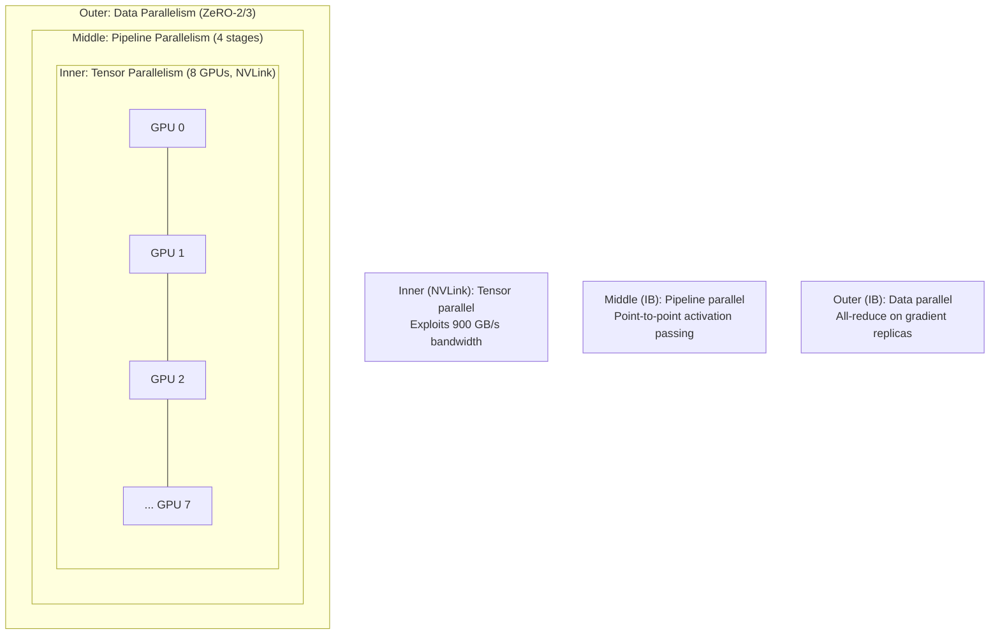
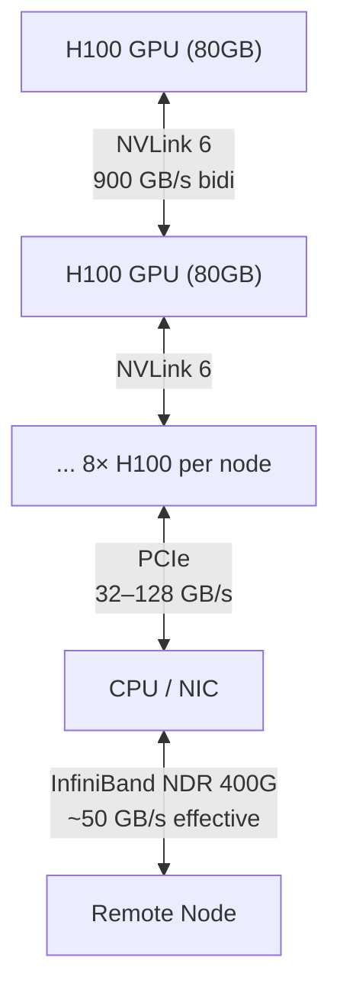

# Chapter 7: Distributed Training and Infrastructure

> [!IMPORTANT]
> **What You Will Learn**
> - Master 3D Parallelism: Data, Tensor, and Pipeline strategies for large-scale training.
> - Understand ZeRO optimizer stages and when to use each.
> - Configure mixed-precision training (BF16/FP8) for correctness and speed.
> - Design fault-tolerant training systems at 1,000+ GPU scale.
> - Select and tune optimizers and learning rate schedules for pre-training.

---

## Parallelism Strategies

A single GPU holds roughly 40–80 GB of VRAM. A 70B parameter model in BF16 requires ~140 GB just for weights — before gradients, optimizer states, or activations. Distributed training solves this through four complementary parallelism strategies.

| Strategy | What Is Sharded | Communication | Primary Benefit |
| :--- | :--- | :--- | :--- |
| Data Parallelism | Optimizer state / gradients / params (ZeRO) | All-reduce gradients | Throughput scaling |
| Tensor Parallelism | Individual weight matrices | All-reduce per layer | Layer-level memory |
| Pipeline Parallelism | Model layers (stages) | Point-to-point activations | Model depth scaling |
| Expert Parallelism | MoE expert weights | All-to-all (tokens → experts) | MoE VRAM distribution |

### Data Parallelism and ZeRO

Standard data parallelism (DDP) replicates the full model on every GPU and all-reduces gradients after each backward pass. Memory is the bottleneck: at 175B parameters, the optimizer state alone (AdamW: 2 momentum tensors + weights) requires ~2 TB across a cluster.

**ZeRO (Zero Redundancy Optimizer)** — DeepSpeed — eliminates this redundancy by sharding optimizer state, gradients, and parameters across data-parallel ranks.

| ZeRO Stage | What Is Sharded | Memory Reduction (175B) | Communication Overhead |
| :--- | :--- | :--- | :--- |
| Stage 1 | Optimizer states only | 4× | Minimal — scatter/gather at update |
| Stage 2 | Optimizer states + gradients | 8× | Moderate — reduce-scatter |
| Stage 3 | Optimizer states + gradients + parameters | 64×+ | Higher — all-gather at each layer |

> [!TIP]
> **ZeRO Stage Selection.** Use Stage 2 as the default — it provides 8× memory reduction with moderate communication overhead. Reserve Stage 3 for models that don't fit in memory even with Stage 2, as the all-gather on every forward/backward pass can reduce throughput 20–40% on bandwidth-limited clusters.

**FSDP (PyTorch)** is the PyTorch-native equivalent of ZeRO-3, with tighter integration into the PyTorch ecosystem and strong support in Hugging Face `transformers`.

### Tensor Parallelism

Split individual weight matrices across GPUs. A linear layer $Y = XW$ with $W \in \mathbb{R}^{d \times 4d}$ is split into column-parallel chunks processed independently, then all-reduced:

```
GPU 0: Y₀ = X · W[:, :2d]
GPU 1: Y₁ = X · W[:, 2d:]
All-reduce → Y = [Y₀ | Y₁]
```

Requires NVLink bandwidth (600–900 GB/s) — tensor parallelism across slow cross-node links is typically not worthwhile. Practical degree: 2–8 GPUs within a single node.

### Pipeline Parallelism and the 1F1B Schedule

Distribute model layers into $p$ pipeline stages, one stage per group of GPUs. Micro-batching hides the pipeline bubble:

$$\text{Bubble fraction} = \frac{p - 1}{p \cdot m}$$

where $p$ is the number of pipeline stages and $m$ is the number of micro-batches. At $m = 8$ and $p = 4$: bubble ≈ 9.4%.

**1F1B (One Forward, One Backward):** Each stage alternates forward and backward micro-batches rather than filling the pipeline with all forward passes first. Reduces peak activation memory from $O(p \cdot m)$ to $O(p)$.

### 3D Parallelism

Combines all three strategies. The nesting order matters for bandwidth efficiency:



**Rule of thumb:** Tensor-parallel degree = GPUs per node (NVLink domain). Pipeline-parallel degree = number of nodes per replica. Data-parallel degree = total nodes ÷ nodes per replica.

DeepSpeed 3D + ZeRO-3 achieved **95% GPU utilization** on 1,024 A100s for GPT-3 (175B).

---

## Mixed-Precision Training

### BF16 (Brain Float 16)

The dominant format for LLM training since 2023. Same 8-bit exponent as FP32 (same dynamic range), with a 7-bit mantissa (FP32 has 23-bit mantissa). Key property: gradient overflow/underflow is rare because the exponent range matches FP32.

```
FP32:  [sign 1][exponent 8][mantissa 23]  — full precision
BF16:  [sign 1][exponent 8][mantissa  7]  — truncated mantissa, same range
FP16:  [sign 1][exponent 5][mantissa 10]  — smaller range, overflow risk
```

**Mixed-precision pattern:** Forward and backward passes in BF16. Master weights and optimizer state in FP32. Gradient scaling is not required (unlike FP16 training).

### FP8 (Emerging Frontier)

Native H100/H200 hardware support. Two sub-formats:
- **E4M3:** 4 exponent bits, 3 mantissa — higher precision, narrower range. Used for **weights and activations**.
- **E5M2:** 5 exponent bits, 2 mantissa — wider range. Used for **gradients**.

FP8 requires **per-tensor scaling factors** (computed from running max absolute values) to prevent underflow/overflow. The Transformer Engine (NVIDIA) handles this automatically.

| Format | Bytes/param | Relative Training Cost | Notes |
| :--- | :--- | :--- | :--- |
| FP32 | 4 | 1× (baseline) | Master weights only |
| BF16 | 2 | ~0.5× | Standard training format |
| FP8 | 1 | ~0.35× | H100/H200 native, needs scaling |

> [!WARNING]
> **FP8 training is not plug-and-play.** Without correct per-tensor scaling, FP8 training silently diverges with NaN loss after thousands of steps. Use the NVIDIA Transformer Engine or carefully implement delayed scaling. Always validate FP8 runs against BF16 on a small model before committing to a full run.

---

## Checkpointing and Fault Tolerance

At 1,000+ GPU scale, hardware failures occur approximately every **3 days** (MTBF). Without fault tolerance, a 30-day training run would restart from scratch multiple times.

### Checkpoint Strategy

| Strategy | Overhead | Recovery Point | When to Use |
| :--- | :--- | :--- | :--- |
| Synchronous checkpoint | High (pause training) | Exact step | Small clusters |
| Asynchronous checkpoint | Near-zero | Lag by ~100 steps | Large clusters |
| Sharded distributed checkpoint | Low (parallel I/O) | Exact step | ZeRO-3 / FSDP |
| In-memory checkpoint | Zero | Exact step | Single-node, fast |

**Asynchronous checkpointing** copies model state to CPU memory on a background thread while training continues on GPU. At 175B parameters in BF16, CPU copy takes ~30 seconds; the GPU continues training during the entire copy.

### Fault-Tolerant Training Pattern

1. **Checkpoint every N steps** (N = 500–2,000 depending on checkpoint cost).
2. **Monitor training health signals:** loss value, gradient norm, GPU temperature, NaN/Inf detection.
3. **Automatic restart:** Launch script detects non-zero exit code and restarts from the latest valid checkpoint.
4. **Exclude bad nodes:** Log which GPU/node caused the failure; exclude from the restarted job if hardware is suspect.

> [!NOTE]
> **Straggler Detection.** In a synchronous gradient all-reduce, the slowest GPU determines the step time. One failing or throttling GPU can cut cluster throughput by 20–30%. Monitor per-GPU step time and flag stragglers automatically.

---

## Communication Optimization

### Interconnect Hierarchy



| Link | Bandwidth | Latency | Used For |
| :--- | :--- | :--- | :--- |
| NVLink 6 (H100) | 900 GB/s bidi | ~1 µs | Tensor parallelism (intra-node) |
| PCIe 5.0 | 128 GB/s | ~5 µs | CPU↔GPU transfers |
| InfiniBand NDR 400G | ~50 GB/s effective | ~3 µs | Pipeline / data parallelism |
| Ethernet (100GbE) | ~12 GB/s | ~10 µs | Budget clusters |

### Overlap and Compression

- **Gradient communication overlap:** Overlap all-reduce with the backward pass using gradient bucketing (PyTorch DDP default bucket size: 25 MB).
- **Top-$k$ sparsification:** Communicate only the top-$k$ gradient values by magnitude. 99% sparsification with error feedback preserves convergence at 100× bandwidth reduction — used in bandwidth-limited setups (Ethernet clusters).
- **1-bit Adam / PowerSGD:** Quantized or low-rank gradient communication. Effective for large batch sizes where gradient variance is low.

---

## Optimizers and Learning Rate Schedules

Full update rules and runnable code in [Appendix G](app_g_implementation_treasury.md): AdamW, Muon, Lion, cosine schedule.

### Optimizer Comparison

| Optimizer | Memory (×model) | Speed vs AdamW | Best For |
| :--- | :--- | :--- | :--- |
| AdamW | 3× | Baseline | Universal default |
| Muon | 2× | +10–25% | Pre-training, large LR |
| Lion | 2× | +5–15% | Fine-tuning, memory-constrained |
| Sophia | 4× | +80–120% | Research, fast convergence |

**AdamW** (Loshchilov & Hutter, 2019): The 2025–2026 default. Decoupled weight decay — applies $\lambda\theta$ directly rather than through the gradient, which correctly regularizes adaptive learning rates. Standard hyperparameters: $\beta_1=0.9$, $\beta_2=0.95$, $\epsilon=10^{-8}$, $\lambda=0.1$.

**Muon** (Kosson et al., 2024): Applies Nesterov momentum then orthogonalizes the update via Newton-Schulz iterations. Treats weight matrices as the correct unit (not individual scalars), ensuring uniform exploration of all weight-space directions. Matches or exceeds AdamW at lower optimizer step cost. See [Appendix G](app_g_implementation_treasury.md).

**Lion** (Chen et al., 2023): Sign-based update — uses only the sign of a gradient momentum blend. 2–3× less memory than AdamW (no second moment). Requires 3–10× smaller LR than AdamW. Strong for fine-tuning; mixed results at full pre-training scale. See [Appendix G](app_g_implementation_treasury.md).

**Sophia** (Liu et al., 2023): Diagonal Hessian preconditioned optimizer. Estimates curvature via Hutchinson estimator every 10 steps. Reported 2× faster than AdamW; not yet widely adopted due to implementation complexity.

### Learning Rate Schedule

Cosine decay with linear warmup is the standard for pre-training and SFT. Full implementation in [Appendix G](app_g_implementation_treasury.md).

$$\eta(t) = \eta_\min + \frac{1}{2}\left(\eta_\max - \eta_\min\right)\left(1 + \cos\!\left(\frac{t - t_\text{warmup}}{T - t_\text{warmup}}\,\pi\right)\right)$$

**Key hyperparameters:**

| Parameter | Typical Value | Rationale |
| :--- | :--- | :--- |
| Warmup steps | 1,000–5,000 | Prevents gradient explosions from random init |
| Peak LR $\eta_\max$ | $3\times10^{-4}$ (7B), $1\times10^{-4}$ (70B) | Larger models need smaller LR |
| Final LR $\eta_\min$ | $0.1\times\eta_\max$ | Do not decay to zero — avoids tail overfitting |
| Batch size | 1M–4M tokens | Large batches enable higher peak LR |

**WSD Schedule (Warmup–Stable–Decay):** Used by MiniCPM and Qwen. Three phases: warmup → constant "stable" phase → rapid cosine decay. Enables checkpointing the model at multiple token counts without a performance cliff — each checkpoint can be continued or further decayed independently.

```
WSD:      ↗ ─────────────── ↘
Cosine:   ↗ ↘↘↘↘↘↘↘↘↘↘↘↘↘↘↘↘
```

### Gradient Clipping and Stability

- **Gradient norm clipping:** Clip global gradient norm to 1.0. More than 1% of steps hitting the clip threshold signals a hyperparameter problem (LR too high, data quality issue).
- **Loss spike detection:** Monitor loss every 100 steps. A spike >3× the rolling average indicates corrupted data, a bad batch, or numerical instability. Automated rollback to the previous checkpoint recovers in minutes.
- **Batch size scaling:** When doubling batch size, multiply LR by $\sqrt{2}$ (square-root rule — more conservative than linear scaling for LLMs). Use gradient accumulation to simulate large effective batch sizes without increasing per-device memory.

---

## Key Training Frameworks

| Framework | Primary Use | Key Features |
| :--- | :--- | :--- |
| Megatron-LM | Large-scale pre-training | Tensor / pipeline / sequence parallelism |
| DeepSpeed | Distributed training | ZeRO optimizer stages 1–3, pipeline parallelism |
| FSDP (PyTorch) | Data-parallel training | ZeRO-3 equivalent, native PyTorch |
| NeMo (NVIDIA) | End-to-end platform | Pre-training to deployment, curated recipes |
| Axolotl | Fine-tuning workflows | LoRA, QLoRA, full fine-tuning, easy config |
| Unsloth | Memory-efficient tuning | 2–5× faster, 80% less memory, GRPO support |
| TRL (Hugging Face) | Alignment training | PPO, DPO, GRPO, SimPO trainers (v0.28+) |

### FSDP vs. DeepSpeed ZeRO-3

| Aspect | FSDP | DeepSpeed ZeRO-3 |
| :--- | :--- | :--- |
| Integration | Native PyTorch | Plugin / wrapper |
| Ease of use | Higher (native APIs) | Moderate (config JSON) |
| Performance | Comparable | Slightly higher peak throughput |
| FP8 support | Via Transformer Engine | Via Transformer Engine |
| MoE support | Limited | First-class (Expert Parallelism) |

---

[← Previous Chapter](ch06_pretraining_objectives.md) | [Table of Contents](../README.md#table-of-contents) | [Next Chapter →](ch08_sft.md)
