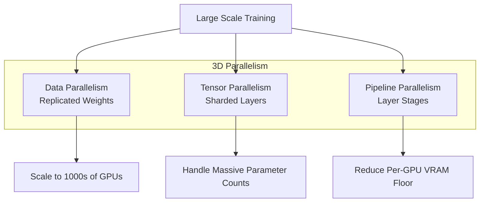

# Distributed Training and Infrastructure

> [!IMPORTANT]
> **What You Will Learn**
> - Master 3D Parallelism: Data, Tensor, and Pipeline strategies for scale.
> - Review ZeRO optimizer sharding and communication-efficient NCCL patterns.
> - Implement mixed-precision (BF16/FP8) and fault-tolerant training.
> - Evaluate the 2026 frontier training frameworks (Megatron, DeepSpeed v2).

## Parallelism Strategies

  - **Data Parallelism:** FSDP and DeepSpeed ZeRO shard optimizer states, gradients, and parameters.
  - **Tensor Parallelism:** Split individual layers across GPUs (Megatron-LM). Column/row-parallel linear layers with all-reduce at boundaries.
  - **Pipeline Parallelism:** Distribute model layers with micro-batching. The 1F1B schedule minimizes bubble overhead to $\frac{p-1}{p \cdot m}$ where $p$ = pipeline stages, $m$ = micro-batches.
  - **Expert Parallelism:** MoE-specific expert distribution across devices.
  - **Sequence Parallelism:** Ring Attention for distributed long-context attention.

### 3D Parallelism

Combining data, tensor, and pipeline parallelism simultaneously. Used for training models beyond 70B parameters:

  - **Inner (intra-node):** Tensor parallelism exploiting NVLink bandwidth (8-16 GPUs).
  - **Middle (inter-node):** Pipeline parallelism across nodes.
  - **Outer:** Data parallelism across replica groups.

DeepSpeed 3D parallelism + ZeRO-3 achieved 95% GPU utilization on 1,024 A100s for a 175B model.

## Mixed-Precision Training

BF16 (dominant, same exponent range as FP32) and FP8 (emerging frontier, native H100/H200 support). FP8 requires careful per-tensor or per-row scaling factors to prevent underflow and overflow.

## Checkpointing and Fault Tolerance

Periodic snapshots, asynchronous checkpointing, distributed sharding, automatic restart/recovery. At 1,000+ GPU scale, mean time between failures of ~3 days makes fault tolerance critical. Async checkpointing overlaps saving with training at near-zero overhead.

## Communication Optimization

  - **NVLink:** 600-900 GB/s bidirectional within a node (vs. 32 GB/s PCIe). Essential for tensor parallelism.
  - **InfiniBand (400G):** 50-100 GB/s cross-node. All-reduce is the dominant communication pattern.
  - **Gradient compression:** Top-$k$ sparsification or quantized gradients for bandwidth-limited setups.

## Optimizers and Learning Rate Schedules

Full update rules and code in [Appendix G](app_g_implementation_treasury.md): AdamW, Lion, cosine schedule.

### Optimizer Selection

  - **AdamW** [loshchilov2019decoupled]: The 2025-2026 default. Adam with decoupled weight decay. Hyperparameters: $\beta_1 = 0.9$, $\beta_2 = 0.95$, $\epsilon = 10^{-8}$, weight decay $= 0.1$ (higher than the original $0.01$ recommendation for LLM pre-training). Decoupled weight decay (unlike L2 regularization) correctly regularizes adaptive learning rates.

  - **Muon (Momentum + Orthogonalization)** [kosson2024muon]: Applies a Nesterov momentum update followed by orthogonalization via Newton-Schulz iterations. It treats weight matrices as the correct unit of analysis rather than individual scalars, ensuring that all directions in weight space are explored with equal intensity. Matches or exceeds AdamW on pre-training perplexity with 25% fewer FLOPs on the optimizer step (see formulation [Appendix G](app_g_implementation_treasury.md), code [Appendix G](app_g_implementation_treasury.md)).

  - **Lion (EvoLved Sign Momentum)** [chen2023symbolic]: Sign-based update rule: uses only the sign of the gradient momentum, not its magnitude. 2-3x memory reduction vs. AdamW (no second moment). Effective learning rate typically needs to be 3-10x smaller than AdamW. Works well for fine-tuning; mixed results at large pre-training scale (formulation [Appendix G](app_g_implementation_treasury.md), code [Appendix G](app_g_implementation_treasury.md)).

  - **Sophia** [liu2023sophia]: Diagonal Hessian preconditioned optimizer. Estimates curvature via Hutchinson estimator every 10 steps. Reported 2x faster than AdamW on pre-training; not yet widely adopted due to implementation complexity.

### Learning Rate Schedule

Cosine decay with linear warmup is the standard:

$$

\eta(t) = \eta_\text{min} + \frac{1}{2}\left(\eta_\text{max} - \eta_\text{min}\right)\left(1 + \cos\left(\frac{t - t_\text{warmup}}{T - t_\text{warmup}}\pi\right)\right)

$$

  - **Warmup steps:** 1,000-5,000 tokens. Prevents gradient explosions from random initial parameter distributions.
  - **Peak LR:** $3 \times 10^{-4}$ (7B), $1 \times 10^{-4}$ (70B). Larger models require smaller peak LR because parameter interactions are stronger.
  - **Final LR:** $\eta_\text{min} = 0.1 \times \eta_\text{max}$ (10% of peak). Do not decay to zero: residual LR prevents overfitting on the tail of training.
  - **WSD (Warmup-Stable-Decay):** Used by MiniCPM and Qwen. Three-phase schedule: warmup $\rightarrow$ constant "stable" phase $\rightarrow$ rapid decay. Enables model checkpointing at multiple scales without performance cliff.

### Gradient Clipping and Stability

  - **Gradient norm clipping:** Clip global gradient norm to 1.0. Prevents occasional spike tokens from destabilizing training. Empirically, more than 1% of steps exceeding the clip threshold indicates a hyperparameter problem.
  - **Loss spike detection:** Monitor loss every 100 steps. A spike $>3\times$ the rolling average often indicates corrupted data, a bad batch, or a numerical instability. Automated checkpointing allows rollback.
  - **Batch size scaling:** Linear scaling rule: if batch size doubles, multiply LR by $\sqrt{2}$ (square root rule is more conservative than linear for LLMs). Use gradient accumulation to simulate large effective batch sizes without increasing per-device memory.

| **Optimizer** | **Memory Footprint** | **Speed** | **Best For** |
|---|---|---|---|
| AdamW | 3x model | Standard | Universal default |
| Muon | 2x model | +10-25% | Pre-training, large LR |
| Lion | 2x model | +5-15% | Fine-tuning, memory-constrained |
| Sophia | 4x model | +80-120% | Research, fast convergence |

*Table: Optimizer memory footprint and speed comparison (relative to model size)*

## Key Training Frameworks

| **Framework** | **Primary Use** | **Key Features** |
|---|---|---|
| Megatron-LM | Large-scale pre-training | Tensor/pipeline/sequence parallelism |
| DeepSpeed | Distributed training | ZeRO optimizer, pipeline parallelism |
| FSDP (PyTorch) | Data-parallel training | Integrated PyTorch ecosystem |
| NeMo (NVIDIA) | End-to-end platform | Pre-training to deployment |
| Axolotl | Fine-tuning workflows | LoRA, QLoRA, full fine-tuning |
| Unsloth | Memory-efficient tuning | 2-5x faster, 80% less memory |
| TRL (Hugging Face) | Alignment training | PPO, DPO, GRPO trainers (v0.28+) |

*Table: Key training frameworks in 2025-2026*

---

[← Previous Chapter](ch06_pretraining_objectives.md) | [Table of Contents](../README.md#table-of-contents) | [Next Chapter →](ch08_sft.md)