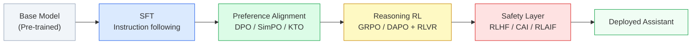
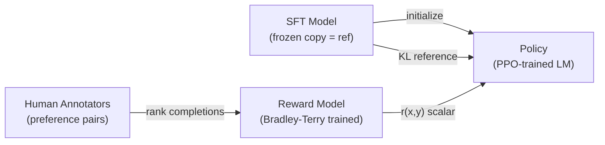
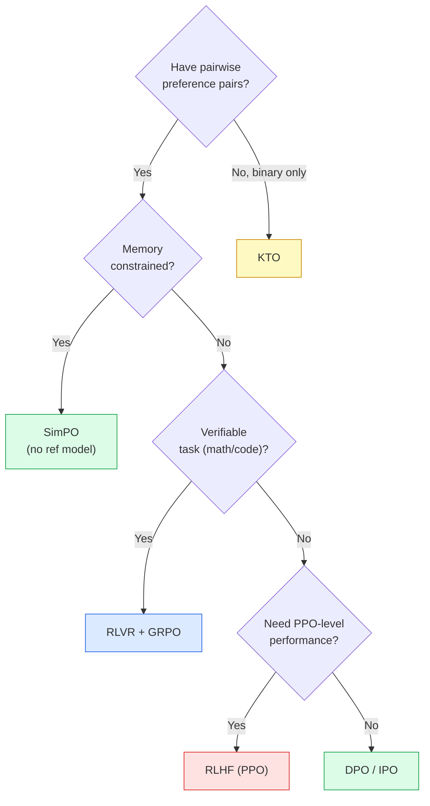

# Chapter 9: Alignment — RLHF, DPO, and Beyond

> [!IMPORTANT]
> **What You Will Learn**
> - Trace the evolution from RLHF to reference-free methods (DPO, SimPO, KTO).
> - Understand reward modeling, reward hacking, and Process Reward Models (PRM).
> - Implement group-relative RL (GRPO, DAPO) for reasoning-heavy models.
> - Apply verifiable rewards (RLVR) and Constitutional AI for scalable safety.
> - Design a modular alignment stack for a production LLM.

---

## The Alignment Problem

A grammatically perfect base model may be unhelpful, evasive, or unsafe. **Alignment** is the process of steering model behavior toward human values: being helpful, honest, and harmless.

The field has evolved rapidly. Early systems relied exclusively on RLHF. By 2025–2026, best practice is a **modular stack** of complementary methods, each targeting a different failure mode.



---

## Reward Modeling

The **reward model (RM)** translates human preferences into a scalar score. It is the central component of RLHF and sets the ceiling on what downstream RL can achieve.

### Architecture

The RM is a language model with a **scalar regression head** replacing the language model head:

$$r_\phi(x, y) = W_r \cdot h_\text{last}(x, y) \in \mathbb{R}$$

where $h_\text{last}$ is the final hidden state of the last token.

### Training: Bradley-Terry Model

Given a preference pair $(y_w, y_l)$ for prompt $x$ (where $y_w$ is the preferred "winner" and $y_l$ is the "loser"), the RM is trained via the Bradley-Terry ranking loss (Ziegler et al., 2019):

$$\mathcal{L}_\mathrm{RM} = -\mathbb{E}_{(x,\,y_w,\,y_l)}\!\left[\log\sigma\!\left(r_\phi(x, y_w) - r_\phi(x, y_l)\right)\right]$$

This is equivalent to binary cross-entropy: the RM learns to assign higher scores to preferred completions.

### Reward Hacking

When the policy is optimized too aggressively against the RM, it exploits blind spots — producing outputs that score high but diverge from true human preferences (Goodhart's Law: *any measure becomes a poor measure once it's a target*).

Mitigations:

| Mitigation | Mechanism | Trade-off |
| :--- | :--- | :--- |
| KL penalty | $\mathcal{L} = r_\phi(y) - \beta\,\mathrm{KL}[\pi_\theta \| \pi_\mathrm{ref}]$ | Limits policy improvement rate |
| Early stopping | Stop RL once reward plateaus | Leaves capability on the table |
| Iterative RM refresh | Retrain RM on new policy samples | Expensive but effective |
| Constitutional AI | Rule-based reward, not learned | Less flexible |

### Process Reward Models (PRM)

Standard RMs score the **final answer** only — a sparse signal. Process Reward Models (Lightman et al., 2023) score each **intermediate reasoning step**:

$$r_\phi(x, y) \rightarrow \{r_1, r_2, \ldots, r_K\} \quad \text{(one score per step)}$$

Benefits:
- $K\times$ denser supervision signal.
- Enables **early pruning** of incorrect solution branches during tree search.
- Used in OpenAI's o-series for competition mathematics.

> [!NOTE]
> **Labeling PRMs is expensive.** Step-level human labels cost ~10× more than outcome labels. Mitigation: use **automated step labeling** — a step is labeled positive if it lies on a path that leads to the correct final answer (outcome consistency). This allows PRM training at scale without human step-level annotation.

---

## RLHF: Reinforcement Learning from Human Feedback

RLHF (Ouyang et al., 2022) transformed GPT-3 into ChatGPT — the first demonstration that RL could make a large model dramatically more useful and safe.

### Pipeline



### PPO Objective

$$\mathcal{L}_\mathrm{PPO}(\theta) = \mathbb{E}_t\!\left[\min\!\left(r_t(\theta)\hat{A}_t,\;\mathrm{clip}(r_t(\theta),\,1{-}\epsilon,\,1{+}\epsilon)\,\hat{A}_t\right)\right] - \beta\,\mathrm{KL}[\pi_\theta \| \pi_\mathrm{ref}]$$

The KL term keeps the policy close to the reference (SFT) model, preventing reward hacking and preserving pre-training capabilities.

### RLHF Challenges

| Challenge | Description | Mitigation |
| :--- | :--- | :--- |
| 4-model memory | SFT ref + RM + critic + policy all in VRAM | ZeRO-3, offloading |
| Reward hacking | Policy exploits RM blind spots | KL penalty, RM refresh |
| Credit assignment | Long sequences = sparse reward | PRM, intermediate checkpoints |
| Annotation cost | Pairwise labels are expensive | RLAIF, Constitutional AI |

---

## DPO: Direct Preference Optimization

DPO (Rafailov et al., 2023) eliminates the reward model entirely. It reformulates preference learning as a **binary classification problem** over pairs:

$$\mathcal{L}_\mathrm{DPO}(\theta) = -\mathbb{E}_{(x,\,y_w,\,y_l)}\!\left[\log\sigma\!\left(\beta\log\frac{\pi_\theta(y_w|x)}{\pi_\mathrm{ref}(y_w|x)} - \beta\log\frac{\pi_\theta(y_l|x)}{\pi_\mathrm{ref}(y_l|x)}\right)\right]$$

The key insight: the optimal RLHF policy can be expressed in closed form as $\pi^*(y|x) \propto \pi_\mathrm{ref}(y|x)\exp(r^*(x,y)/\beta)$. DPO reparameterizes $r$ in terms of $\pi_\theta$, eliminating the need to train a separate RM.

**Result:** 90–95% of RLHF quality at 40–60% less compute. No reward model. No PPO. Single classification loss.

See [Appendix G](app_g_implementation_treasury.md) for formula derivation and full implementation.

### DPO Data Requirements

DPO trains on triplets: `(prompt, chosen_response, rejected_response)`. Data quality matters more than quantity:

- **Distribution match:** Preference pairs should reflect the current policy's output distribution. Pairs from a much stronger or weaker model create a distribution gap.
- **Margin:** Pairs where the quality difference is clear train more reliably than near-ties.
- **Diversity:** Cover the full space of user intents, not just easy/clear-cut cases.

### DPO Successors

> [!TIP]
> **Choosing a DPO variant.** Use standard DPO as a baseline. If you lack a reference model (memory/compute constraints), use SimPO. If you have only binary feedback (thumbs up/down) rather than ranked pairs, use KTO. If the policy has drifted far from the SFT model, use Iterative DPO.

| Method | Key Change from DPO | Reference Model | Best For |
| :--- | :--- | :--- | :--- |
| DPO | Baseline | Required | General alignment |
| SimPO | Length-normalized avg log-prob as reward + margin $\gamma$ | **Not required** | Memory-constrained setups |
| KTO | Binary (not pairwise) feedback; Kahneman-Tversky utility | Required | Implicit signals (clicks, regen) |
| Iterative DPO | Re-sample pairs from current policy each round | Required | Closing distribution gap |
| IPO | Regularized DPO — prevents overfitting to preference margins | Required | Overfit-prone small datasets |
| ORPO | Combines SFT and preference losses in a single objective | **Not required** | Efficient single-stage training |

**SimPO** (Meng et al., 2024): replaces per-token log-prob ratio with a length-normalized average, and adds a target margin $\gamma$:

$$\mathcal{L}_\mathrm{SimPO} = -\mathbb{E}\!\left[\log\sigma\!\left(\frac{\beta}{|y_w|}\log\pi_\theta(y_w|x) - \frac{\beta}{|y_l|}\log\pi_\theta(y_l|x) - \gamma\right)\right]$$

Achieves +6.4 AlpacaEval 2 points vs. DPO. No reference model inference at training time.

**KTO** (Ethayarajh et al., 2024): trains from binary feedback by maximizing the Kahneman-Tversky utility of model outputs. Uses thumbs-up/thumbs-down labels directly — no pairwise ranking needed. See [Appendix G](app_g_implementation_treasury.md).

---

## GRPO: Group Relative Policy Optimization

GRPO (Guo et al., 2025 — DeepSeek-R1) eliminates the PPO critic model by computing advantages within a **group of responses sampled from the same prompt**:

$$\hat{A}_i = \frac{r_i - \mu_r}{\sigma_r}, \qquad \mu_r = \frac{1}{G}\sum_{i=1}^G r_i, \quad \sigma_r = \mathrm{std}(r_1,\ldots,r_G)$$

The full GRPO objective:

$$\mathcal{L}_\mathrm{GRPO}(\theta) = -\mathbb{E}\!\left[\frac{1}{G}\sum_{i=1}^{G}\min\!\left(\rho_i\hat{A}_i,\;\mathrm{clip}(\rho_i,1{-}\epsilon,1{+}\epsilon)\hat{A}_i\right) - \beta\,\mathrm{KL}[\pi_\theta\|\pi_\mathrm{ref}]\right]$$

where $\rho_i = \pi_\theta(o_i|q) / \pi_\mathrm{old}(o_i|q)$ is the importance ratio.

**Advantages over PPO:**
- No critic model — saves 33–50% VRAM.
- More stable on reasoning tasks with sparse rewards (binary correct/incorrect).
- Group normalization provides a natural baseline with no extra computation.

**Typical hyperparameters:** $G = 8$–$16$, $\epsilon = 0.2$, $\beta = 0.001$–$0.01$.

See [Appendix G](app_g_implementation_treasury.md) for full implementation.

---

## DAPO: Decoupled Alignment and Policy Optimization

DAPO (Yu et al., 2025) removes the reference model from GRPO's KL penalty, further reducing memory overhead and simplifying training:

1. **No reference model** — KL regularization replaced by a clip-only constraint.
2. **Clip-higher** — asymmetric clipping: $[1-\epsilon, 1+\epsilon_\text{high}]$ where $\epsilon_\text{high} > \epsilon$. Allows larger policy improvements when the advantage is positive; restricts degradation.
3. **Token-level loss normalization** — divides the loss by the number of tokens in each completion rather than the number of completions. Prevents short completions from dominating gradients.

```python
# DAPO clip-higher asymmetric clipping
def dapo_clip(ratio, advantage, eps_low=0.2, eps_high=0.4):
    if advantage >= 0:
        return torch.clamp(ratio, 1 - eps_low, 1 + eps_high)
    else:
        return torch.clamp(ratio, 1 - eps_low, 1 + eps_low)
```

See [Appendix G](app_g_implementation_treasury.md) for full DAPO loss implementation.

---

## RLVR: Reinforcement Learning with Verifiable Rewards

RLVR replaces the learned reward model with **rule-based verifiers** — programs that objectively check correctness:

| Domain | Verifier | Reward Signal |
| :--- | :--- | :--- |
| Mathematics | Symbolic solver (SymPy, Mathematica) | Binary: answer correct/incorrect |
| Coding | Unit test runner | Binary or partial credit per test |
| Formal proofs | Lean / Coq checker | Binary: proof valid/invalid |
| SQL | Query execution + result match | Binary or fuzzy string match |

**Why verifiable rewards are superior to learned RMs:**
- No reward hacking — the verifier cannot be fooled by outputs that *look* correct.
- Zero annotation cost after defining the task.
- Binary signal is noisy but unbiased; learned RMs are lower-variance but potentially biased.

### DeepSeek R1-Zero

DeepSeek R1-Zero trained on pure RLVR + GRPO with **no SFT cold start**. Starting from the base model:

- AIME 2024 accuracy: **15.6% → 71.0%** from pure RL.
- Emergent behaviors: self-verification ("wait, let me reconsider"), backtracking, extended thinking chains.
- Weakness: language mixing, repetition, poor readability — requiring a later SFT cold-start stage.

> [!WARNING]
> **Pure RLVR without SFT cold-start is unstable.** R1-Zero exhibits language mixing and repetition. DeepSeek's production pipeline (R1) starts with a cold-start SFT phase of a few thousand high-quality chain-of-thought examples before GRPO. This stabilizes training without sacrificing the emergent reasoning capabilities.

See [Appendix G](app_g_implementation_treasury.md) for RLVR step implementation.

---

## RLAIF and Constitutional AI

### RLAIF

RLAIF (Reinforcement Learning from AI Feedback) replaces human annotators with an AI judge. Instead of humans ranking completions, a strong model (e.g., Claude, GPT-4) produces preference labels.

At scale, RLAIF enables preference dataset generation at orders of magnitude lower cost than human annotation. Quality is lower than expert human annotation but higher than crowdsourced labels for most domains.

### Constitutional AI (CAI)

Anthropic's Constitutional AI (Bai et al., 2022) provides a scalable, auditable framework for safety alignment:

**Phase 1 — SL-CAI (Supervised Learning):**

```
1. Sample a harmful response from the model
2. Prompt the model to critique this response against a written constitution
   (e.g., "Does this response support illegal activities?")
3. Revise the response based on the critique
4. Collect revised responses as SFT training data
```

**Phase 2 — RL-CAI:**

```
1. Use the SL-CAI model to generate preference pairs (revised > original)
2. Train a preference model (PM) on these AI-generated pairs (RLAIF)
3. Fine-tune with RL against the PM
```

**Advantages of CAI:**
- The constitution is **explicit and auditable** — you can see exactly what principles guide alignment.
- Scales with model capability — a stronger model produces better self-critiques.
- Generalizes to harm categories not explicitly in the training pairs.

> [!NOTE]
> **Constitutional vs. RLHF.** RLHF captures *what* humans prefer but not *why*. Constitutional AI makes the *why* explicit via written principles. The trade-off: CAI is more auditable but less flexible; RLHF adapts to nuanced human preferences that are hard to articulate as rules.

---

## Retrieval-Aware Training (RAG Alignment)

Production models in 2026 are increasingly deployed with retrieval-augmented generation (RAG). **RAG alignment** trains the model to use retrieved context correctly — not just accurately, but faithfully.

### Three Training Objectives

**1. Citation Alignment (SFT)**
Train on examples where every factual claim includes a bracketed reference to the source document:

```
Context: [Doc 1] The Eiffel Tower is 330 meters tall.
Response: The Eiffel Tower is 330 meters tall [Doc 1].
```

**2. Conflict Handling**
Train on "conflict sets" where the retrieved document contradicts the model's parametric knowledge. The model should follow the **context** over its **priors**:

```
Context: [Doc 1] The Eiffel Tower was completed in 1889.
(Model's prior: 1889 — agrees. No conflict.)

Context: [Doc 1] The population of Paris is 2.1 million.
(Model's prior: ~2.16M — close. Follow context.)

Context: [Doc 1] Water boils at 90°C at sea level.
(Model's prior: 100°C — conflict. Ideally: flag contradiction.)
```

**3. RA-DIT (Retrieval-Augmented Data Integration)**
A two-stage fine-tuning approach (Lin et al., 2023) that aligns both the LLM and the retriever jointly:

1. Fine-tune the LLM to use retrieved passages more effectively.
2. Fine-tune the retriever to produce passages the LLM can use.
3. Iterate — the two models bootstrap each other.

---

## The Modern Alignment Stack

| Alignment Goal | Method | What It Solves |
| :--- | :--- | :--- |
| Instruction Following | SFT | Format, tone, task execution |
| Preference Alignment | DPO / SimPO / KTO | Human values, norms, style |
| Reasoning | GRPO / DAPO + RLVR | Math, code, planning |
| Grounding / RAG | Citation SFT / RA-DIT | Factuality, external knowledge use |
| Safety & Helpfulness | RLHF (neural RM) | Open-ended quality, harm avoidance |
| Constitutional Guardrails | CAI / RLAIF | Scalable, auditable safety principles |

### Method Selection Guide



### Alignment Method Comparison

| Method | Reward Model | Reference Model | Memory vs. PPO | Quality vs. RLHF |
| :--- | :--- | :--- | :--- | :--- |
| PPO (RLHF) | Neural RM | Yes (KL ref) | Baseline (4 models) | Baseline |
| DPO | None | Yes | −50% | 90–95% |
| SimPO | None | **No** | −60% | ~DPO |
| KTO | None | Yes | −50% | ~DPO (binary data) |
| GRPO | Rule-based | Yes | −33% (no critic) | Superior on reasoning |
| DAPO | Rule-based | **No** | −50% (no critic, no ref) | ~GRPO |
| RLVR | Verifier | Optional | −33% | Superior on verifiable tasks |

---

[← Previous Chapter](ch08_sft.md) | [Table of Contents](../README.md#table-of-contents) | [Next Chapter →](ch10_reasoning.md)
