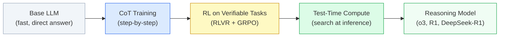
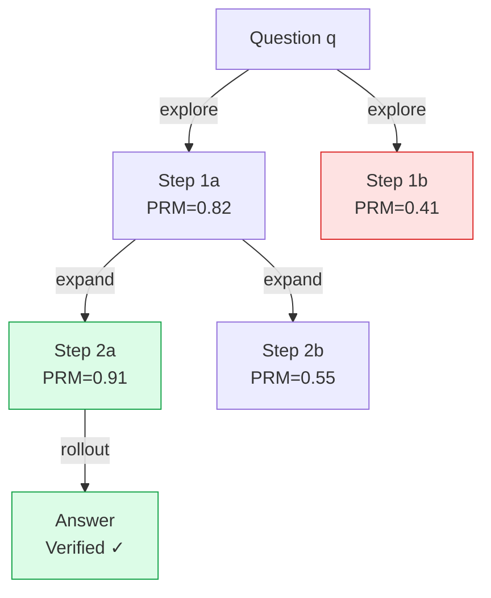
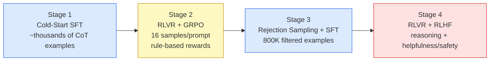
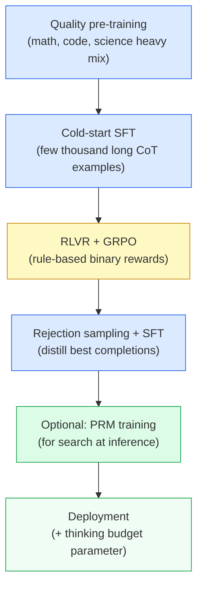

# Chapter 10: Training for Reasoning

> [!IMPORTANT]
> **What You Will Learn**
> - Understand why reasoning is a *trainable* skill, not an emergent property of scale alone.
> - Implement Chain-of-Thought (CoT), self-consistency, and step-level supervision with PRMs.
> - Design test-time compute scaling strategies: Best-of-N, beam search, and MCTS.
> - Train reasoning models with R1-style RLVR + GRPO from first principles.
> - Apply Quiet-STaR thinking tokens for always-on latent reasoning.

---

## The Rise of Reasoning Models

The most significant capability development of 2025–2026: models that explicitly break complex problems into intermediate steps before answering. Reasoning models trade **token efficiency** for **accuracy on hard tasks**.



**The core insight:** reasoning is not a fixed property of a model — it is a *skill* that can be taught and improved with the right training signal. A 7B model trained with RLVR can outperform a naive 70B model on mathematical reasoning.

---

## Chain-of-Thought (CoT)

Prompting or training models to produce intermediate reasoning steps before the final answer. Wei et al. (2022) demonstrated that step-by-step prompting dramatically improves multi-step arithmetic, symbolic reasoning, and commonsense tasks.

### Variants

| Variant | Mechanism | When to Use |
| :--- | :--- | :--- |
| Zero-shot CoT | Append "Let's think step by step" | Quick baseline, no examples needed |
| Few-shot CoT | Provide (question, chain, answer) examples | Higher accuracy when examples are available |
| Auto-CoT | Cluster questions; auto-generate chains with zero-shot CoT | Large-scale, diverse task sets |
| Self-consistency | Sample $k$ chains; majority-vote the final answer | +5–15% GSM8K; reduces variance |
| Tree-of-Thought | Explore multiple reasoning branches simultaneously | Hard combinatorial problems |

### Self-Consistency

Self-consistency (Wang et al., 2022) is the simplest and most reliable test-time improvement:

$$\hat{y} = \arg\max_{y}\sum_{i=1}^{k} \mathbf{1}[\text{ans}(c_i) = y]$$

Sample $k$ independent CoT completions at temperature $T > 0$, then take the majority vote over final answers. Gains: +5–15% on GSM8K and MATH vs. greedy decoding. Diminishing returns above $k \approx 40$.

### Training CoT Models

**Distillation-based:** Generate CoT traces from a strong model (GPT-4, Claude); fine-tune a smaller model on (question, chain, answer) triples. Llama 3.1's instruction model uses this approach.

**RL-based (R1-style):** Start from a base model; apply GRPO with a binary correctness reward on the final answer. The model learns to generate useful reasoning chains as a means to reach correct answers — no chain supervision needed. See [R1-Style Pure RL Training](#r1-style-pure-rl-training) below.

> [!NOTE]
> **CoT format matters.** Models trained on XML-tagged reasoning (`<think>...</think><answer>...</answer>`) learn cleaner separation between reasoning and output than models trained on free-form chains. DeepSeek R1 uses this format explicitly.

---

## Process Reward Models (PRM)

Standard outcome reward models (ORM) score the **final answer** only — a binary signal once per problem. Process Reward Models (Lightman et al., 2023) score each **intermediate reasoning step**, providing denser supervision.

$$r_\phi(x, s_{1:K}) = \{r_1, r_2, \ldots, r_K\}, \quad r_k \in [0, 1]$$

### Benefits vs. Outcome RM

| Property | Outcome RM | Process RM |
| :--- | :--- | :--- |
| Supervision density | 1 signal per problem | $K$ signals per problem |
| Branch pruning | Post-hoc only | Real-time during search |
| Credit assignment | Sparse — full chain must be correct | Step-level — isolates mistakes |
| Annotation cost | Low | High (step labels needed) |
| Resistance to hacking | Moderate | Higher (harder to produce plausible-looking wrong steps) |

### Step-Level Labeling at Scale

Human step-level annotation is ~10× more expensive than outcome annotation. Two scalable alternatives:

**Outcome Consistency Labeling:** A step is labeled **positive** if it appears on at least one path that leads to the correct final answer. Efficient with best-of-N sampling: generate $N$ complete solutions, label all steps on correct paths as positive.

**Monte Carlo Estimation:** For step $s_k$ in a partial chain, estimate $p(\text{correct} \mid s_{1:k})$ by sampling many completions from $s_k$ and computing the fraction that reach the correct answer. This is the approach used in Math-Shepherd.

### Using a PRM for Search

```
Input: question q
1. Generate initial reasoning step candidates with the policy
2. Score each candidate with PRM → keep top-b (beam width)
3. For each kept step, generate next-step candidates
4. Repeat until answer token generated
5. Return the complete chain with highest cumulative PRM score
```

PRM-guided beam search outperforms Best-of-N at equal inference compute on MATH and AIME benchmarks.

---

## Test-Time Compute Scaling

More inference compute per query → better answers. Snell et al. (2024) showed that **test-time compute scaling is competitive with training-time scaling**: a model with $16\times$ more test-time compute can match a model $16\times$ larger on reasoning benchmarks.

> [!TIP]
> **This creates a new performance axis.** Instead of asking "do we need a bigger model?", ask "should we spend more compute at inference time?" For hard, infrequent tasks (medical diagnosis, legal analysis, competition math), heavy test-time compute on a smaller model is often cheaper than deploying a much larger model.

### Best-of-N Sampling

Sample $N$ independent completions; select the best using an ORM, PRM, or verifier:

$$\hat{y} = \arg\max_{y_1, \ldots, y_N} \text{ORM}(x, y_i)$$

**Compute cost:** $N \times$ a single forward pass. **Returns:** logarithmic in $N$ — most of the gain is in the first 16–32 samples.

### Beam Search over Reasoning Steps

Expand the top-$b$ partial chains at each step using a PRM to prune:

$$\mathcal{B}_{k+1} = \text{top-}b\!\left(\{(c, s) : c \in \mathcal{B}_k,\; s \in \text{children}(c)\},\; \text{score} = \text{PRM}(c \cdot s)\right)$$

More compute-efficient than Best-of-N for long multi-step problems. Beam width $b = 4$–$16$ covers most practical settings.

### Monte Carlo Tree Search (MCTS)

Full tree exploration with PRM-based value estimates. Used in AlphaCode 2 and OpenAI o3:



MCTS balances **exploration** (visit underexplored branches) and **exploitation** (follow high-value branches) using the UCT criterion:

$$\text{UCT}(s) = \bar{v}(s) + c\sqrt{\frac{\ln N(s_\text{parent})}{N(s)}}$$

where $\bar{v}(s)$ is the mean rollout value (from PRM), $N(s)$ is the visit count, and $c$ controls the exploration-exploitation trade-off.

### Test-Time Compute: Strategy Comparison

| Strategy | Compute | Parallelizable | Best For |
| :--- | :--- | :--- | :--- |
| Greedy decoding | $1\times$ | N/A | Latency-critical |
| Self-consistency (k=32) | $32\times$ | Yes | Short reasoning, high accuracy |
| Best-of-N (N=64) | $64\times$ | Yes | Any task with a verifier |
| Beam search (b=8) | $8\times$ seq | Partial | Multi-step math/code |
| MCTS | Variable | Partial | Hard combinatorial tasks |

---

## R1-Style Pure RL Training

DeepSeek (Guo et al., 2025) demonstrated that **emergent reasoning** can be produced by pure RL on verifiable tasks — no chain-of-thought supervision required.

### R1-Zero: Pure RL from Base Model

**Training setup:**
1. Start from the pre-trained base model (no SFT, no instruction tuning).
2. Apply GRPO (see [Chapter 9](ch09_alignment.md)) with a binary correctness reward.
3. Format reward: small bonus for using `<think>...</think>` tags correctly.

**Results:**
- AIME 2024: **15.6% → 71.0%** accuracy purely from RL.
- Emergent behaviors observed during training (not programmed):
  - **Self-verification:** "Wait, let me reconsider my previous step."
  - **Backtracking:** Abandoning a wrong approach mid-solution.
  - **Extended thinking:** Spontaneously allocating more reasoning steps to harder problems.
  - **Strategy switching:** Trying a different mathematical approach when stuck.

> [!WARNING]
> **Pure RL without cold-start SFT is unstable in production.** R1-Zero exhibits language mixing (switching languages mid-response), repetitive patterns, and poor formatting. The DeepSeek production pipeline (R1) uses a **cold-start SFT phase** of a few thousand high-quality CoT examples before GRPO. This stabilizes training without losing emergent reasoning.

### R1 Production Pipeline (4 Stages)



**Stage 1 — Cold-Start SFT:** A small set of high-quality long-form CoT examples (collected by prompting R1-Zero and filtering for quality). Establishes clean formatting and language consistency.

**Stage 2 — RLVR + GRPO:** Group size $G=16$, rule-based rewards (answer correctness for math, unit tests for code). No neural reward model — eliminates reward hacking. Major reasoning capability gains happen here.

**Stage 3 — Rejection Sampling + SFT:** Generate completions from Stage 2 model; keep the correct ones (rejection sampling). Mix with general-capability SFT data. Trains the model to generalize beyond pure reasoning tasks.

**Stage 4 — Final RL:** Joint RLVR (reasoning) + RLHF (helpfulness, safety) with separate reward models.

### Reward Design for RLVR

| Reward Signal | Format | Notes |
| :--- | :--- | :--- |
| Answer correctness | Binary 0/1 | Primary signal for math/code |
| Format compliance | Binary 0/1 | Reward for correct `<think>` tags |
| Length penalty | Negative for excessive length | Prevents padding to inflate reward |
| Unit test pass rate | Fraction 0–1 | Partial credit for code |

> [!NOTE]
> **Keep reward design simple.** Complex reward shaping (e.g., step-level partial credit without a PRM) often introduces unintended incentives. DeepSeek R1's success came from a deliberately simple binary reward — the model learned all emergent behaviors from this single clean signal.

---

## TLT: Token-Level Training for Accelerated Reasoning

MIT (2025) introduced **Tandem Language Training (TLT)**, a draft-verify training scheme:

1. A smaller **drafter** model predicts token sequences.
2. A larger **verifier** model confirms or corrects predictions in parallel.
3. The drafter is trained on the verifier's corrections, improving over time.

**Results:** 70–210% training acceleration with preserved accuracy across benchmarks.

**Dual use:** The trained drafter is directly reusable as the **draft model for speculative decoding** at inference time — a single training investment yields both faster training and faster inference.

---

## Quiet-STaR: Thinking Tokens

Rather than confining reasoning to a pre-response phase, Quiet-STaR (Zelikman et al., 2024) trains the model to generate **latent "thinking" tokens at every position** in the sequence:

```
Standard:  The answer is 42.
Quiet-STaR: <think>if the question is about arithmetic...</think> The answer is 42.
            (at every token position, not just before the answer)
```

### Mechanism

1. **Divergent thinking:** At each token position, generate $m$ parallel "thought" tokens in a background channel.
2. **Mixing:** Combine the hidden states with and without the thought via a learned mixing head.
3. **Token-level RL:** Reward thoughts that reduce the cross-entropy loss of the next *real* token. Thoughts that improve prediction are reinforced; unhelpful thoughts are suppressed.

### Trade-offs

> [!TIP]
> **Thinking tokens create an always-on reasoning mode.** Unlike CoT (which is only active when the user asks for reasoning), Quiet-STaR applies latent reasoning even to simple factual lookups. A 7B model with 16 thinking tokens can approach 70B performance on several reasoning benchmarks — at a fixed cost increase of $m \times$ per token generated.

| Aspect | Value |
| :--- | :--- |
| Compute overhead | $m \times$ forward pass per token |
| Typical $m$ | 8–32 |
| Memory overhead | Proportional to $m$ |
| Accuracy gain (7B, MATH) | +8–15% |
| Compared to CoT | CoT is cheaper per query; Quiet-STaR is always-on |

---

## Thinking Modes: Production Implementation

Major frontier labs have converged on **user-selectable thinking depth** as a deployment pattern:

| Model | Thinking Mode | Implementation |
| :--- | :--- | :--- |
| OpenAI o3 / o4-mini | "Reasoning" toggle | Separate model endpoint; MCTS + PRM at inference |
| DeepSeek R1 | Always reasoning | Extended CoT format in every response |
| Gemini 2.5 Pro | "Thinking" budget | Token budget parameter controls depth |
| Qwen3 | `enable_thinking` flag | Toggles `<think>` tag generation |
| Claude 3.7 Sonnet | "Extended thinking" | Hidden scratchpad tokens; user-configurable |

The common pattern: a **thinking budget** parameter controls the maximum test-time compute allocated per query. Higher budget = more MCTS rollouts or longer CoT chains = higher accuracy at higher latency and cost.

---

## Benchmark Performance: Reasoning Models (2025–2026)

| Model | AIME 2024 | MATH-500 | SWE-bench | Notes |
| :--- | :--- | :--- | :--- | :--- |
| GPT-4o (baseline) | 9.3% | 76.6% | 33.2% | No extended thinking |
| DeepSeek R1 | 79.8% | 97.3% | 49.2% | RLVR + GRPO |
| OpenAI o3 | 96.7% | 99.0% | 71.7% | MCTS + PRM |
| OpenAI o4-mini | 93.4% | 99.5% | 68.1% | Efficient reasoning |
| Gemini 2.5 Pro | 92.0% | 98.0% | 63.8% | Thinking budget |
| Qwen3-235B-A22B | 85.7% | 98.2% | 59.1% | MoE + GSPO |

*Results as of April 2026. AIME: American Invitational Mathematics Examination (competition math). SWE-bench: real-world software engineering tasks.*

---

## Summary: Reasoning Training Recipe



---

[← Previous Chapter](ch09_alignment.md) | [Table of Contents](../README.md#table-of-contents) | [Next Chapter →](ch11_distillation.md)
