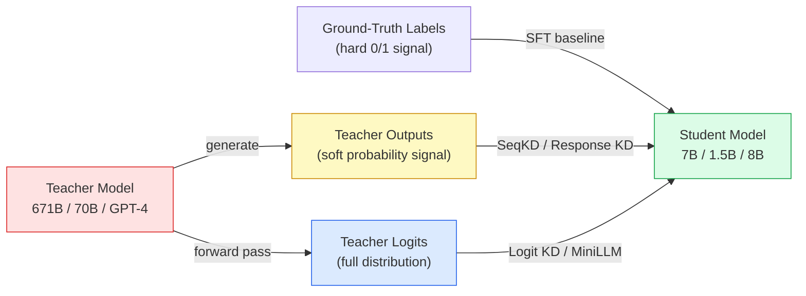
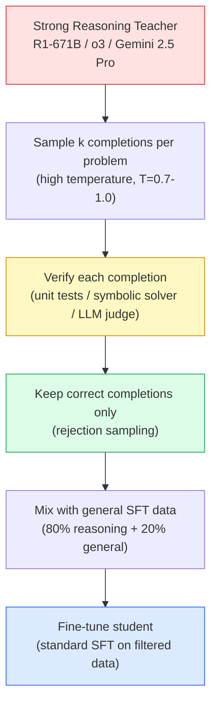
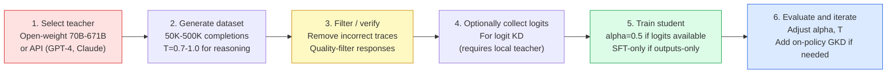

# Chapter 11: Knowledge Distillation and Model Compression

> [!IMPORTANT]
> **What You Will Learn**
> - Understand why distillation produces students stronger than independent training.
> - Compare forward KL, reverse KL (MiniLLM), and sequence-level (SeqKD) objectives.
> - Implement logit-level, feature-level, and on-policy (GKD) distillation.
> - Apply rejection-sampling distillation specifically for reasoning models.
> - Evaluate the distillation pipelines used by Meta, DeepSeek, and Google.

---

## Why Distillation?

A student model trained on ground-truth labels learns only from hard 0/1 signals. A student trained on **teacher outputs** learns from a rich probability distribution — every token position contains information about what the teacher considered plausible, probable, and near-miss alternatives.



**Frontier lab usage:**
- **Meta:** Llama 4 Behemoth (288B) → Scout (17B) / Maverick (17B) via codistillation
- **DeepSeek:** R1-671B → 1.5B, 7B, 8B, 14B, 32B, 70B distilled models
- **Google:** Gemini Pro → Flash → Nano cascade
- **Anthropic:** Claude Sonnet distilled from Opus-class checkpoints

> [!TIP]
> **Distilled 7B models now routinely outperform undistilled 70B models on target tasks.** Distillation is the highest-ROI technique in the post-training toolkit — it transfers capability that would otherwise require 10–100× more parameters.

Full implementations in [Appendix G](app_g_implementation_treasury.md): forward KL, reverse KL, speculative decoding acceptance probability.

---

## Distillation Method Taxonomy

| Method | Teacher Access | Signal Type | Best For |
| :--- | :--- | :--- | :--- |
| Response KD (SFT on outputs) | Outputs only | Hard labels | Closed-source teachers (GPT-4, Claude) |
| SeqKD | Outputs only | Hard labels (beam) | Reasoning, long-form tasks |
| Logit KD (Forward KL) | Logits required | Soft distribution | Open-weight teachers, full signal |
| MiniLLM (Reverse KL) | Logits required | Mode-seeking | Sharp, precise outputs |
| Feature / Attention KD | Internals required | Intermediate states | Architecture-matched pairs |
| GKD (On-Policy) | Logits required | Online soft labels | Distribution mismatch correction |
| Rejection Sampling KD | Outputs + verifier | Filtered hard labels | Reasoning / math / code |

---

## Response Distillation (Output-Level)

The simplest form: generate completions from the teacher and use them as SFT labels for the student. The student minimizes the negative log-likelihood of teacher completions:

$$\mathcal{L}_\mathrm{resp} = -\sum_{t=1}^{T} \log p_\theta(y_t^\mathrm{teacher} \mid x,\, y_{<t}^\mathrm{teacher})$$

**Advantages:** Works with any teacher — including closed-source APIs. No logit access needed. Simple to implement (standard SFT pipeline on teacher-generated data).

**Disadvantage:** Ignores the full teacher probability distribution. The student learns *what* the teacher said, not *how uncertain* the teacher was across alternatives.

---

## Logit-Level Distillation (Forward KL)

When teacher logits are available (open-weight teachers), the student matches the teacher's full output distribution:

$$\mathcal{L}_\mathrm{KD} = \alpha \cdot \mathcal{L}_\mathrm{CE}(y^\mathrm{gt},\, p_\theta) + (1-\alpha) \cdot T^2 \cdot D_\mathrm{KL}\!\left(\mathrm{softmax}(z^\mathrm{teacher}/T) \;\|\; \mathrm{softmax}(z^\mathrm{student}/T)\right)$$

where $T$ is the softmax temperature (typically 2–4) and $\alpha$ balances ground-truth CE and distillation loss.

**Why temperature matters:** At $T=1$, the teacher distribution is sharp — the KL signal is nearly identical to the hard-label CE loss. At $T=3$, the distribution is softened, exposing probability mass on near-correct tokens (e.g., synonyms, paraphrases) that carry rich relational information.

```python
import torch.nn.functional as F

def logit_distillation_loss(
    student_logits,   # (batch, seq_len, vocab)
    teacher_logits,   # (batch, seq_len, vocab)
    labels,           # (batch, seq_len)  -100 for masked tokens
    alpha: float = 0.5,
    temperature: float = 2.0,
) -> float:
    """Combined cross-entropy + forward KL distillation loss."""
    # Ground-truth cross-entropy
    ce_loss = F.cross_entropy(
        student_logits.view(-1, student_logits.size(-1)),
        labels.view(-1),
        ignore_index=-100,
    )
    # Soft KL divergence against teacher
    soft_teacher = F.softmax(teacher_logits / temperature, dim=-1)
    soft_student  = F.log_softmax(student_logits / temperature, dim=-1)
    kd_loss = F.kl_div(
        soft_student, soft_teacher,
        reduction="batchmean", log_target=False,
    ) * (temperature ** 2)

    return alpha * ce_loss + (1 - alpha) * kd_loss
```

---

## Sequence-Level Knowledge Distillation (SeqKD)

Rather than optimizing token-level KL, SeqKD (Kim & Rush, 2016) generates *mode sequences* from the teacher (beam search, $T = 0$) and treats them as hard labels.

**Advantages over response KD:** Beam decoding produces the teacher's most likely output — higher quality than temperature-sampled responses. Avoids the need for online logit access.

**Advantages over logit KD:** No logits required. Cacheable offline. Scales to API-only teachers.

**Used extensively when distilling from GPT-4 or Claude:** Generate 50K–500K beam-decoded completions once, then train the student on them as a standard SFT dataset.

> [!NOTE]
> **SeqKD for reasoning tasks:** For math and code, use high temperature ($T = 0.7$–$1.0$) sampling rather than beam search — you want diverse correct solution paths, not the single most likely solution. Filter by verifier before training: incorrect reasoning chains hurt more than they help.

---

## MiniLLM: Reverse KL Distillation

Standard (forward) KL forces the student to cover **all** teacher modes — including low-probability ones. This leads to *mean-seeking* behavior: the student spreads probability mass across many plausible continuations, making outputs hedged and uncertain.

MiniLLM (Gu et al., 2024) minimizes **reverse KL** instead:

$$\mathcal{L}_\mathrm{rev} = D_\mathrm{KL}(p_\mathrm{student} \| p_\mathrm{teacher}) = \mathbb{E}_{y \sim \pi_\theta}\!\left[\log\frac{p_\theta(y \mid x)}{p_\mathrm{teacher}(y \mid x)}\right]$$

Reverse KL is *mode-seeking*: the student concentrates mass on the teacher's most probable outputs and ignores low-probability alternatives. This produces **sharper, more decisive outputs** — better for task-specific deployment.

**Estimation challenge:** Reverse KL requires sampling from the student distribution $\pi_\theta$. MiniLLM estimates it via policy gradient:

$$\nabla_\theta \mathcal{L}_\mathrm{rev} \approx -\mathbb{E}_{y \sim \pi_\theta}\!\left[\log p_\mathrm{teacher}(y \mid x) \cdot \nabla_\theta \log p_\theta(y \mid x)\right]$$

This makes it more expensive than forward KL but often better for targeted capability transfer.

### Forward KL vs. Reverse KL

| Property | Forward KL | Reverse KL (MiniLLM) |
| :--- | :--- | :--- |
| Behavior | Mean-seeking | Mode-seeking |
| Output style | Hedged, covers alternatives | Sharp, decisive |
| Estimation | Direct (no sampling needed) | Policy gradient (requires sampling) |
| Compute cost | Low | Higher (~2× forward KL) |
| Best for | General capability transfer | Task-specific precise outputs |

---

## Intermediate Layer Distillation

Align hidden states or attention patterns at intermediate layers — not just the output logits.

### Feature-Map Distillation (PKD, TinyBERT)

$$\mathcal{L}_\mathrm{feat} = \sum_l \left\|W_\mathrm{proj}\, h_l^\mathrm{student} - h_{f(l)}^\mathrm{teacher}\right\|_2^2$$

where $f(l)$ maps student layer $l$ to a corresponding teacher layer, and $W_\mathrm{proj}$ is a learned projection (needed when student and teacher have different hidden dimensions).

### Attention-Pattern Distillation

$$\mathcal{L}_\mathrm{attn} = \sum_{l,h} D_\mathrm{KL}\!\left(A_{l,h}^\mathrm{teacher} \;\|\; A_{l,h}^\mathrm{student}\right)$$

summed over layers $l$ and heads $h$.

> [!NOTE]
> **Practical note:** Intermediate distillation requires matching architectures or learned projections and adds significant implementation complexity. Most production pipelines stick to output-level or logit-level distillation. Reserve intermediate distillation for cases where the student is severely capacity-constrained (e.g., sub-1B models).

---

## On-Policy Distillation (GKD)

A key failure mode of offline distillation: the student is trained on teacher-generated trajectories but evaluated on *its own* trajectories. As training proceeds, the student's distribution drifts from the teacher distribution it was trained on — a compounding distribution mismatch.

**GKD (Generalized Knowledge Distillation)** (Agarwal et al., 2024) fixes this with an on-policy loop:

```
Repeat:
  1. Roll out the student to generate candidate completions
  2. Score each completion with the teacher (logits or log-prob)
  3. Minimize KL between student and teacher-scored distribution
  4. Update student weights
```

$$\mathcal{L}_\mathrm{GKD} = \lambda \cdot D_\mathrm{KL}(p_\mathrm{teacher} \| p_\theta) + (1-\lambda) \cdot D_\mathrm{KL}(p_\theta \| p_\mathrm{teacher})$$

The $\lambda$ parameter interpolates between forward and reverse KL. At $\lambda = 1$: pure forward KL (mean-seeking). At $\lambda = 0$: pure reverse KL (mode-seeking).

**Requirements:** White-box teacher logits or a fast teacher inference endpoint. On-policy rollouts are expensive — budget 2–4× the compute of offline distillation.

> [!TIP]
> **When to use GKD vs. offline distillation.** Use offline SeqKD or logit KD as the default — faster and simpler. Switch to GKD only when you observe clear distribution mismatch symptoms: student outputs that differ structurally from the training data (e.g., wrong format, off-topic responses, length mismatch).

---

## Rejection-Sampling Distillation for Reasoning

The dominant distillation strategy for **reasoning models** in 2025–2026. Used in DeepSeek R1, Llama 4 Scout/Maverick, and OpenAI o-series distillation.

### Pipeline



**Why rejection sampling?** The teacher produces both correct and incorrect reasoning traces. Training on incorrect chains actively hurts the student — it learns wrong solution patterns. Filtering to correct-only traces is the single highest-impact data quality step.

**Sampling strategy:** For hard problems, the teacher may need $k = 8$–$32$ attempts to produce one correct trace. For easy problems, $k = 2$–$4$ is sufficient. Use adaptive $k$ based on problem difficulty.

### DeepSeek R1 Distillation Results

| Student Model | AIME 2024 | MATH-500 | Notes |
| :--- | :--- | :--- | :--- |
| DeepSeek-R1-Distill-Qwen-1.5B | 28.9% | 83.9% | 1.5B params |
| DeepSeek-R1-Distill-Qwen-7B | 55.5% | 92.8% | Matches o1-mini |
| DeepSeek-R1-Distill-Llama-8B | 50.4% | 89.1% | From Llama 3.1 base |
| DeepSeek-R1-Distill-Qwen-14B | 69.7% | 93.9% | — |
| DeepSeek-R1-Distill-Qwen-32B | 72.6% | 95.9% | Matches o1 on AIME |
| DeepSeek-R1-Distill-Llama-70B | 70.0% | 94.5% | From Llama 3.3 base |

*Teacher: DeepSeek-R1-671B. Training data: ~800K verified reasoning traces.*

> [!NOTE]
> **The 7B student matches o1-mini** (OpenAI's small reasoning model) on AIME 2024 via distillation alone — without RLVR or GRPO. This demonstrates that for reasoning tasks, **what the teacher knows is transferable even to much smaller students**, as long as the training data is high quality and verifiably correct.

---

## Speculative Decoding as Distillation

Speculative decoding (Leviathan et al., 2023) uses a small draft model to propose $k$ tokens, verified in parallel by the target model. Token $t$ is accepted with probability:

$$\alpha(t) = \min\!\left(1,\, \frac{p_\mathrm{target}(t)}{p_\mathrm{draft}(t)}\right)$$

Beyond a decoding speedup (2–3×), **training the drafter to maximize acceptance rate** is a form of distillation. The drafter learns to approximate the target's conditional distribution — specifically on the 70–90% of "easy" tokens where the target is highly confident.

**TLT connection (MIT, 2025):** The Tandem Language Training framework explicitly trains the drafter via the target's corrections. The resulting drafter serves dual purpose: accelerates both training (70–210% speedup) and inference (via speculative decoding).

---

## Practical Distillation Workflow



> [!TIP]
> **Distillation rules of thumb:**
> - A 7B student distilled from a 70B teacher closes **60–80%** of the capability gap to the teacher.
> - **50K–500K** high-quality teacher completions is sufficient for most fine-tuning objectives.
> - For reasoning tasks: only keep traces leading to **verified correct answers** — incorrect chains actively hurt.
> - Use **offline SeqKD by default**. Add on-policy GKD only if you observe clear distribution mismatch.
> - Distillation data quality >> quantity: 50K curated traces outperform 500K unfiltered ones.

---

## Distillation vs. Other Compression Methods

| Method | Size Reduction | Quality Retention | Training Required | Notes |
| :--- | :--- | :--- | :--- | :--- |
| Knowledge Distillation | Architectural (train smaller) | High (60–80% gap closed) | Full fine-tune | Most capability-preserving |
| Quantization (INT4/AWQ) | 4–8× weight size | Very high (minimal loss) | None / few-shot | Best inference speedup per effort |
| Pruning | Variable | Medium (depends on sparsity) | Fine-tune needed | Unstructured pruning hard to accelerate |
| LoRA / PEFT | No size reduction | N/A (same model) | Adapter only | Reduces training cost, not inference |
| Speculative Decoding | No size reduction | Lossless | Draft model training | Inference speedup only |

Distillation is **the only method that produces a genuinely smaller model with materially higher capability** than a model of the same size trained from scratch. All other methods reduce resource consumption for a fixed model.

---

[← Previous Chapter](ch10_reasoning.md) | [Table of Contents](../README.md#table-of-contents) | [Next Chapter →](ch12_evaluation.md)
