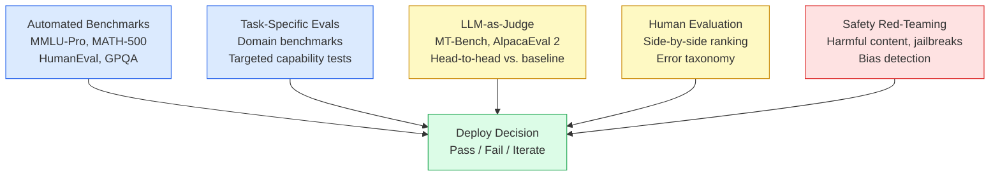

# Chapter 12: Evaluation and Benchmarking

> [!IMPORTANT]
> **What You Will Learn**
> - Select the right benchmark suite for your model's intended use case.
> - Implement LLM-as-Judge correctly, including bias mitigations.
> - Understand Chatbot Arena ELO and when it diverges from academic benchmarks.
> - Detect and prevent benchmark contamination and Goodhart's Law gaming.

---

## Why Evaluation Is Hard

LLMs produce open-ended text. Unlike classification models with a fixed label space, there is no single ground-truth for most LLM tasks. Evaluation requires navigating three fundamental tensions:

1. **Scalability vs. validity:** Human evaluation is valid but expensive and slow; automated metrics are fast but imperfect proxies.
2. **Breadth vs. depth:** Broad benchmarks (MMLU) measure many capabilities shallowly; narrow benchmarks (AIME) measure one capability deeply.
3. **Static vs. dynamic:** Fixed benchmarks get contaminated; dynamic benchmarks are harder to compare across studies.

---

## Standard Benchmark Suite

### Reasoning and Knowledge

| Benchmark | What It Measures | Format | Notes |
| :--- | :--- | :--- | :--- |
| MMLU (57 subjects) | Broad academic knowledge | Multiple choice | Contamination risk; use MMLU-Pro |
| MMLU-Pro | Harder, 10-choice version of MMLU | Multiple choice | More discriminative at frontier |
| GPQA-Diamond | Expert-level graduate science | Multiple choice | Requires PhD-level knowledge |
| ARC-Challenge | Grade-school science reasoning | Multiple choice | Good signal on small models |

### Mathematics

| Benchmark | Difficulty | Format | Notes |
| :--- | :--- | :--- | :--- |
| GSM8K | Grade-school math | Verified answers | Too easy for frontier models (>95%) |
| MATH-500 | Competition math (AMC–AIME level) | Verified answers | Good frontier discriminator |
| AIME 2024 | Competition math (hardest) | Verified answers | Best for top-tier reasoning models |
| OlympiadBench | Mathematical olympiad problems | Verified answers | Multilingual, harder than MATH |

### Coding

| Benchmark | What It Measures | Format | Notes |
| :--- | :--- | :--- | :--- |
| HumanEval | Function completion from docstring | Code execution | ~164 problems; saturating |
| MBPP | Short Python programming tasks | Code execution | More diverse than HumanEval |
| SWE-bench Verified | Real GitHub issue resolution | Code execution | Hardest; requires full repo context |
| LiveCodeBench | Ongoing LeetCode-style problems | Code execution | New problems prevent contamination |

### Instruction Following and Conversation

| Benchmark | What It Measures | Format | Notes |
| :--- | :--- | :--- | :--- |
| MT-Bench | Multi-turn conversation quality | LLM-judged | GPT-4 as judge; 80 questions |
| AlpacaEval 2 | Instruction-following vs. GPT-4 | LLM-judged | Length-controlled version preferred |
| Arena-Hard | Head-to-head vs. GPT-4 Turbo | LLM-judged | Harder subset from Chatbot Arena |
| IFEval | Strict instruction compliance | Rule-based | Verifiable format constraints |

---

## LLM-as-Judge

LLM judges score open-ended responses by prompting a strong model (GPT-4, Claude, Gemini) to compare or rate outputs. Enables scalable evaluation of free-form text without human annotation.

### Common Biases and Mitigations

| Bias | Description | Mitigation |
| :--- | :--- | :--- |
| Position bias | Judges prefer the first option in A/B comparison | Swap positions; average both orderings |
| Verbosity bias | Longer responses rated higher regardless of quality | Length-controlled prompts; penalize padding |
| Self-enhancement | Models rate their own outputs higher | Use a different model family as judge |
| Sycophancy | Judge agrees with confident-sounding wrong answers | Include deliberate wrong-but-confident examples in validation |
| Recency bias | Judge favors the last response in a list | Randomize ordering |

### Prompt Design

A robust judge prompt specifies: evaluation criteria, scoring rubric (1–5 or win/tie/lose), and an explicit instruction to ignore response length in the judgment.

```
You are an impartial judge evaluating AI assistant responses.
Criteria: accuracy, helpfulness, clarity, and safety.
Score the response 1 (very poor) to 5 (excellent).
Do NOT consider response length in your judgment.
Respond with: Score: <number>\nReason: <one sentence>
```

> [!NOTE]
> **W&B Weave** provides a production-ready LLM-as-Judge framework with built-in bias detection, audit trails, and multi-judge consensus. Prefer it over ad-hoc judge prompts for systematic evaluation.

---

## Chatbot Arena and ELO Rankings

**Chatbot Arena** (LMSYS) collects millions of real-user pairwise comparisons ("Which response do you prefer, A or B?") and computes ELO ratings. As of April 2026, it is the most reliable signal for real-world user preference.

**Why Arena ELO diverges from academic benchmarks:**
- Academic benchmarks measure specific narrow capabilities; Arena measures the full user experience.
- A model can have high MMLU (broad knowledge) but low ELO (poor conversational style).
- A model can have moderate MMLU but high ELO (excellent formatting, tone, and brevity).

> [!TIP]
> **Use Arena ELO as the north star for general assistant quality.** Use task-specific benchmarks (MATH-500, SWE-bench) for capability-specific decisions. The two are complementary, not interchangeable.

### Statistical Validity

ELO estimates converge after ~1,000 comparisons per model pair. Models with fewer comparisons have wide confidence intervals — interpret rankings of newer models cautiously until they accumulate sufficient votes.

---

## Benchmark Contamination and Gaming

### Contamination

Evaluation data present in pre-training inflates scores without reflecting true capability improvement.

**Detection methods:**
- N-gram overlap: check if benchmark questions appear verbatim or near-verbatim in the training corpus.
- Perplexity analysis: models score anomalously low perplexity on contaminated questions.
- Canary strings: embed unique strings in evaluation data; detect them in model outputs.

**Reporting practice:** Always state whether decontamination was performed and what method was used. Benchmark scores without decontamination disclosure are unreliable.

### Goodhart's Law

*When a measure becomes a target, it ceases to be a good measure.*

Optimizing specifically for a benchmark — through training on similar problems, hyperparameter search on the test set, or cherry-picking model checkpoints by benchmark score — inflates numbers without improving real capability.

**Mitigations:**
- **Dynamic benchmarks:** Use benchmarks with new questions each run (LiveCodeBench, BIG-Bench Hard).
- **Held-out test sets:** Never use benchmark performance to select checkpoints or hyperparameters — reserve a truly held-out set for final evaluation only.
- **Multi-benchmark suites:** A model that games one benchmark cannot simultaneously game five diverse ones.
- **Human spot-check:** Randomly sample 50–100 model outputs and evaluate them manually before releasing benchmark results.

---

## Evaluation Workflow for a New Model



---

[← Previous Chapter](ch11_distillation.md) | [Table of Contents](../README.md#table-of-contents) | [Next Chapter →](ch13_safety.md)
