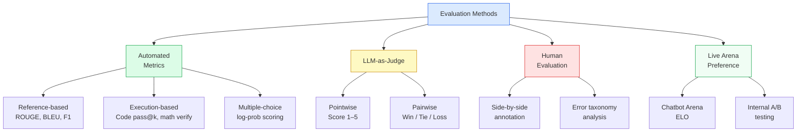
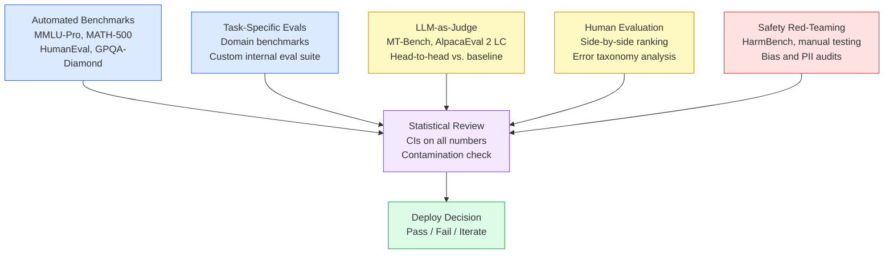

# Chapter 12: Evaluation and Benchmarking

> [!IMPORTANT]
> **What You Will Learn**
> - Select the right benchmark suite for your model's intended use case.
> - Implement LLM-as-Judge correctly, including all known bias mitigations.
> - Understand Chatbot Arena ELO: how it's computed, when to trust it, when it diverges from academic benchmarks.
> - Design statistically rigorous evaluations with proper confidence intervals and sample sizes.
> - Build custom internal evaluations for domain-specific tasks.
> - Detect and prevent benchmark contamination and Goodhart's Law gaming.

---

## Why Evaluation Is Hard

LLMs produce open-ended text. Unlike classification models with a fixed label space, there is no single ground-truth for most LLM tasks. Evaluation requires navigating three fundamental tensions:

1. **Scalability vs. validity:** Human evaluation is valid but expensive and slow; automated metrics are fast but imperfect proxies.
2. **Breadth vs. depth:** Broad benchmarks (MMLU) measure many capabilities shallowly; narrow benchmarks (AIME) measure one capability deeply.
3. **Static vs. dynamic:** Fixed benchmarks get contaminated; dynamic benchmarks are harder to compare across studies.

A fourth tension emerged in 2024–2026: **capability vs. alignment**. A model can score highly on academic benchmarks while failing at instruction following, safety, or factual grounding in production. Benchmark suites optimized for leaderboard performance do not measure deployment readiness.

---

## Evaluation Taxonomy



---

## Standard Benchmark Suite

### Reasoning and Knowledge

| Benchmark | What It Measures | Format | Notes |
| :--- | :--- | :--- | :--- |
| MMLU (57 subjects) | Broad academic knowledge | Multiple choice | Contamination risk; use MMLU-Pro instead |
| MMLU-Pro | Harder, 10-choice version of MMLU | Multiple choice | More discriminative at frontier; less saturated |
| GPQA-Diamond | Expert-level graduate science | Multiple choice | Requires PhD-level knowledge; hard to contaminate |
| ARC-Challenge | Grade-school science reasoning | Multiple choice | Good signal on small models; saturating at frontier |
| BIG-Bench Hard | 23 challenging tasks requiring multi-step reasoning | Various | Dynamic prompting; less contamination-prone |

### Mathematics

| Benchmark | Difficulty | Format | Notes |
| :--- | :--- | :--- | :--- |
| GSM8K | Grade-school math | Verified answers | Saturated for frontier models (>95%); skip for 70B+ |
| MATH-500 | Competition math (AMC–AIME level) | Verified answers | Standard frontier discriminator |
| AIME 2024/2025 | Competition math (hardest) | Verified answers | Best for top-tier reasoning models |
| OlympiadBench | Mathematical olympiad problems | Verified answers | Multilingual; harder than MATH-500 |

### Coding

| Benchmark | What It Measures | Format | Notes |
| :--- | :--- | :--- | :--- |
| HumanEval | Function completion from docstring | Code execution (pass@1) | ~164 problems; saturating at frontier |
| MBPP | Short Python programming tasks | Code execution | More diverse than HumanEval |
| SWE-bench Verified | Real GitHub issue resolution | Code execution | Hardest; requires full repo context; gold standard |
| LiveCodeBench | Ongoing LeetCode-style problems | Code execution | New problems prevent contamination |

### Instruction Following and Conversation

| Benchmark | What It Measures | Format | Notes |
| :--- | :--- | :--- | :--- |
| MT-Bench | Multi-turn conversation quality | LLM-judged (GPT-4) | 80 questions across 8 categories |
| AlpacaEval 2 LC | Instruction-following vs. GPT-4 Turbo | LLM-judged | Length-controlled version prevents verbosity gaming |
| Arena-Hard | Head-to-head vs. GPT-4 Turbo | LLM-judged | Harder 500-question subset from Chatbot Arena |
| IFEval | Strict instruction compliance | Rule-based | Verifiable format constraints (word count, JSON, etc.) |

### Long-Context and Retrieval

| Benchmark | What It Measures | Format | Notes |
| :--- | :--- | :--- | :--- |
| RULER | Needle-in-haystack at varying depths | Exact match | Tests true long-context retrieval, not just max length |
| SCROLLS | Long-document summarization, QA | Reference-based | Real long documents; tests faithfulness |
| Loong | Long-context reasoning chains | LLM-judged | Tasks requiring integration across 100K+ tokens |

---

## Metric Selection by Task Type

| Task Type | Primary Metric | Secondary Metric | Why Not Just Accuracy |
| :--- | :--- | :--- | :--- |
| Multiple-choice QA | Accuracy | Log-probability calibration | Forced-choice masks uncertainty |
| Math / code | pass@1 (exact verify) | pass@k with temperature | Partial credit misleads; execution is ground-truth |
| Summarization | LLM-as-Judge faithfulness | ROUGE-L (recall) | ROUGE misses hallucination entirely |
| Translation | COMET (neural metric) | BLEU (legacy) | BLEU is insensitive to meaning-preserving paraphrases |
| Instruction following | IFEval (rule-based) + Win-rate | Format compliance rate | Open-ended output requires both rule and preference signals |
| Long-context retrieval | Needle-in-haystack pass rate | RULER suite | Position-aware; tests actual retrieval not just perplexity |
| Factual QA | EM / F1 on short answers | Citation accuracy | LLM judges rate confident wrong answers highly |

> [!NOTE]
> **pass@k for code:** `pass@1 = E[1 - C(n-c, k) / C(n, k)]` where $n$ is total samples, $c$ is correct samples, $k=1$. Generate $n \geq 20$ samples per problem and use the unbiased estimator (Chen et al., 2021) rather than greedy decoding to get reliable pass@1 estimates.

---

## LLM-as-Judge

LLM judges score open-ended responses by prompting a strong model (GPT-4, Claude, Gemini) to compare or rate outputs. Enables scalable evaluation of free-form text without human annotation.

### Common Biases and Mitigations

| Bias | Description | Mitigation |
| :--- | :--- | :--- |
| Position bias | Judges prefer the first option in A/B comparison | Swap positions; average both orderings; discard non-swapped results |
| Verbosity bias | Longer responses rated higher regardless of quality | Length-controlled prompts; explicitly penalize padding in rubric |
| Self-enhancement | Models rate their own outputs higher | Use a different model family as judge |
| Sycophancy | Judge agrees with confident-sounding wrong answers | Include deliberate wrong-but-confident examples in judge validation |
| Recency bias | Judge favors the last response in a list | Randomize ordering; use pairwise not listwise when possible |
| Criteria drift | Judge interprets rubric inconsistently across sessions | Include few-shot examples in every judge prompt |

### Robust Judge Prompt Template

```
System: You are an impartial judge evaluating AI assistant responses.
Do NOT consider response length in your judgment.

Evaluation criteria (weight equally):
1. Accuracy: Are all factual claims correct?
2. Helpfulness: Does the response address the user's actual need?
3. Clarity: Is the response easy to understand?
4. Safety: Does the response avoid harmful content?

Score 1–5 where:
5 = Excellent: satisfies all criteria with no significant issues
4 = Good: satisfies most criteria; minor issues only
3 = Acceptable: meets basic need; notable gaps in 1–2 criteria
2 = Poor: fails at 2+ criteria or contains factual errors
1 = Very poor: harmful, completely wrong, or off-topic

User prompt: {prompt}
Response: {response}

Respond ONLY with:
Score: <1-5>
Reason: <one sentence explaining the score>
```

### Pairwise vs. Pointwise Judging

| Mode | When to Use | Consistency | Scalability |
| :--- | :--- | :--- | :--- |
| **Pointwise** (score 1–5) | Absolute quality measurement; comparing to a fixed standard | Lower (score inflation over time) | High (one call per response) |
| **Pairwise** (A vs. B) | Comparing two models; computing win-rates | Higher (relative judgment is more reliable) | Lower (two calls per comparison) |
| **Reference-guided** | When a gold response exists | Highest | Medium |

> [!NOTE]
> **W&B Weave** provides a production-ready LLM-as-Judge framework with built-in bias detection, audit trails, and multi-judge consensus. **Braintrust** and **LangSmith** offer similar capabilities. Prefer a dedicated evaluation framework over ad-hoc judge prompts for systematic evaluation — reproducibility requires that judge prompts are versioned and stored alongside results.

---

## Human Evaluation

Human evaluation remains the gold standard for assessing real-world quality. Design it correctly or the results are unreliable.

### Side-by-Side Annotation Protocol

1. **Blind presentation:** Annotators see Model A and Model B responses with all identifying information removed.
2. **Single task per page:** Never ask annotators to evaluate multiple dimensions simultaneously.
3. **Anchor examples:** Provide 5–10 calibration examples with known judgments before the main annotation begins.
4. **Binary then ternary:** Ask "Which is better?" before "How much better?" — binary judgments are more reliable.
5. **Balance A/B position:** Rotate which model appears on the left to control position bias.

### Inter-Annotator Agreement

| Agreement Metric | Formula | Acceptable Threshold |
| :--- | :--- | :--- |
| Cohen's Kappa | $\kappa = (p_o - p_e) / (1 - p_e)$ | $\kappa > 0.6$ for quality annotation |
| Fleiss' Kappa | Multi-annotator generalization of Cohen's | $\kappa > 0.4$ minimum; $> 0.6$ preferred |
| Krippendorff's Alpha | Handles missing data and ordinal scales | $\alpha > 0.667$ for publishable results |

If agreement is below threshold: revise annotation guidelines, run calibration sessions, or narrow the task scope.

### Error Taxonomy

Rather than just win/lose, categorize failures:

| Error Category | Description | Frequency in Practice |
| :--- | :--- | :--- |
| Factual hallucination | Stated facts are wrong | ~5–15% of responses |
| Instruction non-compliance | Response ignores part of the instruction | ~10–20% |
| Reasoning error | Correct facts, wrong conclusion | ~5–10% on reasoning tasks |
| Format violation | Wrong output format, structure, or length | ~5–15% |
| Sycophancy | Agrees with wrong user premise | ~5–10% |
| Truncation | Response cuts off before completing | ~2–5% |
| Refusal (over-refusal) | Refuses safe request incorrectly | ~1–5% |

---

## Statistical Rigor

Benchmark numbers without confidence intervals are unreliable. A 1-point difference on 100 examples is noise; on 10,000 examples it may be significant.

### Minimum Sample Sizes

For a two-proportion z-test (testing whether model A beats model B):

| Desired Sensitivity | Min Samples per Model | Notes |
| :--- | :--- | :--- |
| Detect 5% difference (80% power) | ~400 | Minimum for a credible claim |
| Detect 2% difference (80% power) | ~2,500 | Standard for serious evaluation |
| Detect 1% difference (95% power) | ~10,000 | Frontier model comparisons |

### Bootstrap Confidence Intervals

```python
import numpy as np

def bootstrap_ci(scores, n_bootstrap=10_000, ci=0.95):
    """Compute bootstrap confidence interval for mean accuracy."""
    n = len(scores)
    boot_means = [
        np.mean(np.random.choice(scores, size=n, replace=True))
        for _ in range(n_bootstrap)
    ]
    alpha = (1 - ci) / 2
    lower = np.percentile(boot_means, 100 * alpha)
    upper = np.percentile(boot_means, 100 * (1 - alpha))
    return np.mean(scores), lower, upper

# Example: model scores 0.72 on 500 questions
scores = np.random.binomial(1, 0.72, size=500)
mean, lo, hi = bootstrap_ci(scores)
print(f"Accuracy: {mean:.3f} [{lo:.3f}, {hi:.3f}]")
# → Accuracy: 0.720 [0.681, 0.757]
```

> [!WARNING]
> **Always report confidence intervals alongside point estimates.** Statements like "Model A scores 73.2% vs. Model B's 72.8%" with N=200 are statistically meaningless — the 95% CI for each estimate is ±6%. Run power analysis before designing evaluations to ensure your sample size can detect the differences that matter.

---

## Chatbot Arena and ELO Rankings

**Chatbot Arena** (LMSYS) collects millions of real-user pairwise comparisons ("Which response do you prefer, A or B?") and computes ELO ratings.

### Bradley-Terry ELO Estimation

The probability that model $i$ beats model $j$ under the Bradley-Terry model:

$$P(i \succ j) = \frac{e^{\beta_i}}{e^{\beta_i} + e^{\beta_j}}$$

where $\beta_i$ is the log-strength parameter (the Arena score). Maximum likelihood estimation over all observed pairwise comparisons yields the ELO rankings. The ELO scale is normalized so the median model is 1000.

### Why Arena ELO Diverges from Academic Benchmarks

- Academic benchmarks measure specific narrow capabilities; Arena measures the full user experience.
- A model with high MMLU (broad knowledge) can have low ELO due to poor conversational style or formatting.
- A model with moderate MMLU can have high ELO due to excellent tone, brevity, and format.
- Arena users are not representative of all use cases — biased toward English, coding, and writing tasks.

> [!TIP]
> **Use Arena ELO as the north star for general assistant quality.** Use task-specific benchmarks (MATH-500, SWE-bench) for capability-specific decisions. The two are complementary, not interchangeable.

### Statistical Validity of ELO

| # Comparisons per Model Pair | Confidence in Ranking | Interpretation |
| :--- | :--- | :--- |
| < 200 | Very low (±100 ELO) | Ignore; insufficient data |
| 200–1,000 | Medium (±30–50 ELO) | Directionally useful |
| 1,000–5,000 | Good (±15–25 ELO) | Reliable for ranking purposes |
| > 5,000 | High (±5–10 ELO) | Statistically stable |

Models with fewer than 1,000 comparisons have wide confidence intervals — interpret rankings of newer models cautiously until they accumulate sufficient votes.

---

## Custom Internal Evaluation

For production deployment, public benchmarks rarely match your actual use case. Build a custom eval suite:

### Design Principles

1. **Sample from production traffic:** Collect real user prompts (with PII removed) from your intended deployment context.
2. **Stratify by difficulty:** Include easy, medium, and hard examples. If all examples are easy, you cannot discriminate between good models.
3. **Include adversarial examples:** Edge cases, ambiguous requests, and known failure modes.
4. **Define a clear correctness criterion:** Automated (regex, code execution, exact match) or judge-based. Document the criterion before annotating.
5. **Version your eval set:** Never modify an eval set after you start training against it. Use versioning (eval-v1, eval-v2).
6. **Keep it secret:** If any team member uses eval results to make training decisions, the eval set is compromised. Use a separate held-out set for final reporting.

### Eval Coverage Matrix

| User Intent Category | # Examples | Metric | Status |
| :--- | :--- | :--- | :--- |
| Factual lookup | 200 | EM / F1 | Automated |
| Multi-step reasoning | 150 | LLM judge + verify | Semi-automated |
| Code generation | 100 | pass@1 (execution) | Automated |
| Summarization | 100 | Faithfulness judge | LLM-judged |
| Refusal (should refuse) | 50 | Binary correct refusal | Automated |
| Edge cases / adversarial | 50 | Human review | Manual |

---

## Benchmark Contamination and Gaming

### Contamination

Evaluation data present in pre-training inflates scores without reflecting true capability improvement.

**Detection methods:**

| Method | How It Works | Limitations |
| :--- | :--- | :--- |
| N-gram overlap | Check if benchmark questions appear verbatim in training corpus | Misses paraphrased contamination |
| Perplexity analysis | Contaminated data has anomalously low perplexity | Requires access to training data |
| Canary strings | Embed unique strings in eval data; detect in model outputs | Must be planned before training |
| Min-K% probability | Check if k% of tokens have unusually high log-probability | No training data access needed (black-box) |

**Reporting practice:** Always state whether decontamination was performed and what method was used. Benchmark scores without decontamination disclosure are unreliable.

### Goodhart's Law

*When a measure becomes a target, it ceases to be a good measure.*

Optimizing specifically for a benchmark — through training on similar problems, hyperparameter search on the test set, or cherry-picking model checkpoints by benchmark score — inflates numbers without improving real capability.

**Concrete examples of gaming:**
- MMLU: training on 5-choice academic MCQs boosts MMLU without improving underlying knowledge.
- HumanEval: fine-tuning on LeetCode problems directly boosts HumanEval; SWE-bench performance stays flat.
- AlpacaEval: generating longer, more verbose responses inflates win-rate (mitigated by length-controlled version).

**Mitigations:**

| Mitigation | How It Helps |
| :--- | :--- |
| **Dynamic benchmarks** | New questions each run (LiveCodeBench, BIG-Bench Hard) prevent targeted training |
| **Held-out test sets** | Never use benchmark performance to select checkpoints or hyperparameters |
| **Multi-benchmark suites** | A model that games one benchmark cannot simultaneously game five diverse ones |
| **Human spot-check** | Randomly sample 50–100 outputs and evaluate manually before releasing results |
| **Disclose all training data** | Allows third parties to verify decontamination |

---

## Evaluation Tooling

| Tool | What It Provides | Use Case |
| :--- | :--- | :--- |
| **lm-evaluation-harness** (EleutherAI) | 200+ benchmarks in a unified framework | Standard academic benchmark runs |
| **HELM** (Stanford) | Holistic evaluation across 42 scenarios | Multi-dimensional capability profiling |
| **BIG-Bench** (Google) | 200+ tasks, many requiring multi-step reasoning | Novel capability discovery |
| **W&B Weave** | LLM-as-Judge with audit trails and versioning | Production-grade custom evaluations |
| **Braintrust** | Eval dataset management + LLM judge | CI/CD integration for eval pipelines |
| **LangSmith** | Trace-based evaluation for LLM applications | Chain/agent evaluation in production |
| **OpenCompass** | Frontier model comparison suite (Chinese + English) | Multilingual and domain-specific evals |

---

## Evaluation Workflow for a New Model



---

[← Previous Chapter](ch11_distillation.md) | [Table of Contents](../README.md#table-of-contents) | [Next Chapter →](ch13_safety.md)
