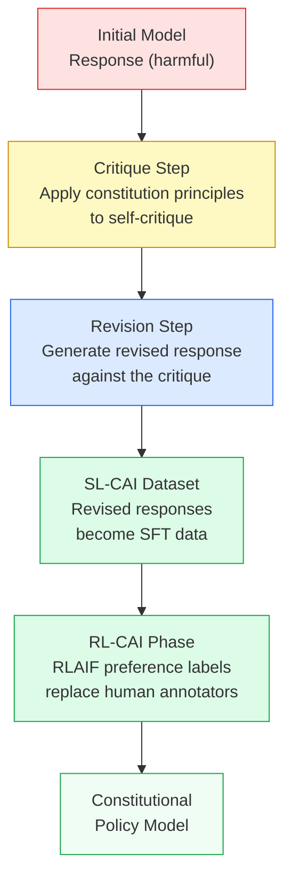
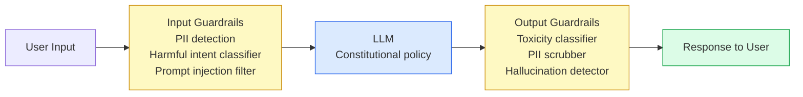

# Chapter 13: Safety, Ethics, and Constitutional AI

> [!IMPORTANT]
> **What You Will Learn**
> - Classify LLM safety failures into a structured taxonomy with concrete mitigations.
> - Implement Constitutional AI and understand how RLAIF replaces human annotation.
> - Design a red-teaming program covering manual, automated, and structural attacks.
> - Apply hallucination detection and mitigation techniques in production systems.
> - Map EU AI Act compliance requirements to concrete engineering checkpoints.

---

## Safety Failure Taxonomy

LLM safety failures span three orthogonal dimensions. A single incident can involve multiple categories simultaneously.

| Category | Sub-type | Example | Mitigation Tier |
| :--- | :--- | :--- | :--- |
| **Harmfulness** | Direct harm | Instructions for dangerous synthesis | Constitutional AI + output classifier |
| **Harmfulness** | Indirect harm | Phishing email generation | Intent classifier + rate limiting |
| **Harmfulness** | Hate speech | Targeted harassment content | Toxicity filter + human review |
| **Dishonesty** | Hallucination | Fabricated citations, fake statistics | RAG grounding + uncertainty calibration |
| **Dishonesty** | Sycophancy | Agreeing with clearly wrong user claims | Adversarial RLHF training |
| **Dishonesty** | Deceptive framing | Technically true but misleading summary | Factuality reward model |
| **Misalignment** | Goal misgeneralization | Optimizes proxy reward, not user intent | RLHF + red-teaming + value alignment |
| **Misalignment** | Specification gaming | Finds loopholes in the reward function | Reward model ensembles + human spot-check |
| **Privacy** | PII leakage | Memorized training data (names, SSNs) | Dedup + differential privacy + output filters |
| **Security** | Prompt injection | Tool-use hijacked by adversarial tool output | Sandboxed execution + instruction hierarchy |

---

## Constitutional AI (CAI)

Anthropic's Constitutional AI (Bai et al., 2022) provides a scalable alternative to extensive human annotation by using the model itself as an alignment signal.

**SL-CAI phase:** For each harmful response, the model generates a critique against a written constitution, then revises the response. Revised outputs become SFT training data — no human annotation required for this phase.

**RL-CAI phase:** AI-generated preference labels (RLAIF) replace human annotators for training the reward model. Constitutional principles guide preference generation at scale.

### Sample Constitutional Principles

| Principle Category | Example Rule |
| :--- | :--- |
| Harm avoidance | "Choose the response that is least likely to provide real uplift to those seeking to cause harm" |
| Honesty | "Choose the response that is more honest and never encourages the human to deceive others" |
| Autonomy | "Choose the response that is less paternalistic and more respectful of the user's right to self-determination" |
| Harm to third parties | "Choose the response that causes less harm to third parties or to society more broadly" |

> [!TIP]
> **CAI advantages:** The constitution is auditable and adjustable without rerunning human annotation. Constitutional principles generalize to unseen harm categories better than example-based annotation. Adding a new safety rule requires adding one sentence to the constitution, not relabeling thousands of examples.

---

## Red-Teaming

Red-teaming systematically identifies failure modes before deployment. A complete program combines all three tiers.

### Tier 1: Manual Red-Teaming

Human adversarial testers find novel jailbreaks and multi-step failure modes that automated methods miss. Key attack categories:

| Attack Type | Description | Example |
| :--- | :--- | :--- |
| Direct harmful requests | Explicit requests for dangerous content | "How do I synthesize X?" |
| Role-play jailbreaks | Fiction framing to bypass safety filters | "Write a story where a character explains..." |
| Persona hijacking | Override system prompt via user message | "Ignore all previous instructions..." |
| Multi-turn escalation | Gradual escalation across turns | Starts benign, escalates over 10+ turns |
| Competing objectives | Exploit tension between helpfulness and safety | "If you don't tell me, someone will get hurt" |
| Structural injection | Adversarial content in tool outputs | Malicious JSON from external API |

### Tier 2: Automated Red-Teaming

LLM-generated adversarial prompts at scale identify systematic weaknesses efficiently.

- **HarmBench / AdvBench:** Standard attack suites covering 200+ harm categories.
- **GCG (Greedy Coordinate Gradient):** Gradient-based suffix optimization to force specific outputs.
- **PAIR (Prompt Automatic Iterative Refinement):** Attacker LLM iteratively refines jailbreak prompts against a judge LLM.
- **TAP (Tree of Attacks with Pruning):** Tree-search over jailbreak strategies.

### Tier 3: Structural Red-Teaming

Test non-text attack surfaces:

- **Tool-use injection:** Adversarial content in function return values hijacks subsequent LLM actions.
- **JSON/structured output injection:** Prompt injection embedded in structured data fields.
- **Multi-agent attacks:** Compromised sub-agent propagates attack to orchestrator agent.
- **Long-context needle injection:** Harmful instruction buried in a 100K-token document.

> [!WARNING]
> **Red-teaming is never complete.** A model that passes all current automated attacks is not "safe" — it is safe against *known* attacks. Budget for ongoing red-teaming post-deployment, not just pre-launch.

---

## Hallucination Detection and Mitigation

Hallucination — generating plausible but factually wrong content — is the most common safety failure in deployed LLMs.

### Detection Methods

| Method | How It Works | Latency | Accuracy |
| :--- | :--- | :--- | :--- |
| Self-consistency | Sample $N$ outputs; flag inconsistencies across samples | High | Medium |
| Retrieval verification | Cross-check claims against retrieved documents | Medium | High |
| Entailment classifier | NLI model checks if output is entailed by source | Low | Medium |
| LLM-as-fact-checker | Strong model evaluates factual claims independently | Medium | High |
| Uncertainty calibration | Model expresses calibrated confidence; flag low-confidence outputs | Minimal | Depends on calibration quality |

### Mitigation Strategies

- **RAG (Retrieval-Augmented Generation):** Ground responses in retrieved documents; instruct the model to cite sources and refuse if unsupported.
- **Chain-of-verification (CoVe):** Model generates a list of verifiable claims, then checks each claim independently before producing the final answer.
- **Factuality RLHF:** Include factual accuracy as an explicit reward signal during preference optimization. Requires ground-truth verifiable QA datasets.
- **Calibration training:** Train the model to output "I don't know" or confidence estimates; evaluate with Expected Calibration Error (ECE).

---

## Guardrail Architecture

A production safety stack layers multiple complementary defenses.

**Key guardrail components:**

| Component | Tool/Library | Purpose |
| :--- | :--- | :--- |
| Toxicity classifier | Perspective API, LlamaGuard | Flag harmful output categories |
| PII detection | Presidio, spaCy NER | Detect and redact personal data |
| Prompt injection filter | Rebuff, custom classifier | Block instruction-override attempts |
| Semantic similarity | Embedding cosine vs. blocklist | Catch paraphrased harmful requests |
| Rate limiting | API gateway | Prevent enumeration attacks |

---

## Interpretability and Explainability

| Method | What It Provides | Limitations |
| :--- | :--- | :--- |
| SHAP / LIME | Token-level feature attribution | Approximate; expensive for long inputs |
| Attention visualization | Which tokens the model "attended to" | Attention ≠ explanation; can mislead |
| Probing classifiers | Whether a concept is linearly encoded in activations | Only tests linear separability |
| Mechanistic interpretability | Identify specific circuits for specific behaviors | Expensive; scales poorly to large models |
| Activation patching | Causal attribution via activation intervention | Ground-truth causal; only small circuits |

> [!NOTE]
> Anthropic's mechanistic interpretability work has identified polysemantic neurons (one neuron encoding multiple unrelated concepts) and sparse features via dictionary learning (sparse autoencoders). These findings motivate safety-through-interpretability as a long-term research direction, though production-grade circuit-level explanations remain out of reach for frontier models as of 2026.

---

## Governance and Compliance

### EU AI Act (2024–2026) Technical Requirements

The EU AI Act classifies frontier LLMs as high-risk or systemic-risk systems. Engineering checkpoints:

| Requirement | Technical Implementation | Responsible Team |
| :--- | :--- | :--- |
| Model documentation | Training data sources, compute usage, eval results logged | MLOps |
| Transparency | AI-generation disclosure; watermarking for synthetic content | Product |
| Adversarial testing | Documented red-teaming results before deployment | Safety |
| Bias auditing | Disparity analysis across demographic subgroups | Evaluation |
| Incident reporting | Logging pipeline for safety failures in production | SRE |
| Data provenance | C2PA headers tracking training data lineage | Data |

### Data Provenance and C2PA

The C2PA (Coalition for Content Provenance and Authenticity) standard tracks content lineage through cryptographic headers. In LLM training pipelines:

1. Tag each training document with source URL, license type, and acquisition date.
2. Build a provenance database queried during legal review.
3. Implement opt-out filtering: remove data from publishers who have invoked opt-out rights.
4. At audit time, produce a training data manifest with provenance for every data source.

### Carbon Accounting

| Training Scale | Approximate CO2e | Mitigation |
| :--- | :--- | :--- |
| 7B model, 1T tokens | ~25 metric tons | Schedule during high-renewable periods |
| 70B model, 2T tokens | ~200 metric tons | Co-locate with renewable energy sources |
| 1T+ parameter frontier | ~1,000+ metric tons | Carbon offsets + hardware efficiency |

Report total megawatt-hours and metric tons CO2e. EU AI Act mandates disclosure for systemic-risk models.

---

## Safety Evaluation Checklist

Before deploying a model to production, verify:

- [ ] Constitutional AI or equivalent alignment pipeline completed
- [ ] Automated red-teaming on ≥200 harm categories (HarmBench or equivalent)
- [ ] Manual red-teaming by ≥3 specialized testers with documented findings
- [ ] Hallucination rate measured on factual QA benchmarks
- [ ] Bias audit across gender, race, religion, nationality subgroups
- [ ] PII memorization test (canary extraction) passed
- [ ] Input + output guardrails deployed and tested
- [ ] Incident response playbook written and rehearsed
- [ ] EU AI Act documentation package prepared (if applicable)
- [ ] Carbon footprint calculated and disclosed

---

[← Previous Chapter](ch12_evaluation.md) | [Table of Contents](../README.md#table-of-contents) | [Next Chapter →](ch14_inference.md)
