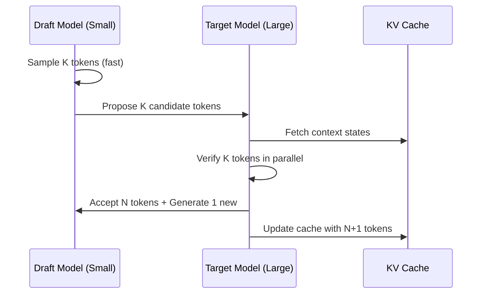

# Inference and Deployment at Scale

> [!IMPORTANT]
> **What You Will Learn**
> - Distinguish between throughput-bound and memory-bound inference.
> - Master KV cache management (PagedAttention, RadixAttention).
> - Implement the 2026 quantization stack (H100 FP8, post-training quantization).
> - Optimize throughput with speculative decoding and drafting.

## Quantization

| **Format** | **Memory/Speed Benefit** | **Quality Loss** | **Best For** |
|---|---|---|---|
| FP16 / BF16 | 2x | Minimal | Training |
| INT8 (LLM.int8) [dettmers2022llmint8] | ~4x | Negligible | Serving large models |
| INT4 / GPTQ / AWQ | ~8x | Small | Throughput-optimized serving |
| GGUF (Q4_K_M) | ~6x | Small | Local / edge inference |
| FP8 | 4x | Minimal | H100/H200 native serving |
| 1.58-bit (BitNet) | ~20x | Moderate | Research / edge |

*Table: Quantization formats and trade-offs*

## Inference Frameworks

vLLM (PagedAttention), TGI (Hugging Face), TensorRT-LLM (NVIDIA), llama.cpp/Llamafile (local/edge).

## Speculative Decoding

A small draft model generates $k$ tokens; the large target model verifies all $k$ in parallel [leviathan2023fast]. 2-3x speedup, zero quality loss. Works best when the draft model acceptance rate is high. Medusa: multiple parallel draft heads on the target model itself, eliminating the separate draft model.

## Continuous Batching

Naive batching waits for all requests in a batch to complete before accepting new ones---wasteful when requests differ in length. Continuous batching [yu2022orca] inserts new requests as slots free up, achieving near-100% GPU utilization.

## KV Cache Management

Formulas and implementations in [Appendix G](app_g_implementation_treasury.md): KV cache management, quantization bounds, and speculative decoding code.

  - **PagedAttention (vLLM)** [kwon2023efficient]: Non-contiguous physical KV cache blocks managed like OS virtual memory. Eliminates fragmentation, enables 2-4x more concurrent requests.
  - **Prefix caching:** Cache shared system prompt KV states across requests. 50-80% cache hit rates for common deployments.
  - **KV quantization:** Quantize cached KV to INT8/INT4 to extend effective context within fixed memory.

## Multi-GPU Inference

For models exceeding single-GPU VRAM, use tensor parallelism at inference:

  - 2-4 GPUs: tensor parallelism within a node (NVLink bandwidth sufficient).
  - 8+ GPUs: tensor + pipeline parallelism.
  - Reference: a 70B model at BF16 requires 4x A100-80GB; INT4 fits on 2x A100-40GB.

---

[← Previous Chapter](ch13_safety.md) | [Table of Contents](../README.md#table-of-contents) | [Next Chapter →](ch15_domain_multimodal.md)