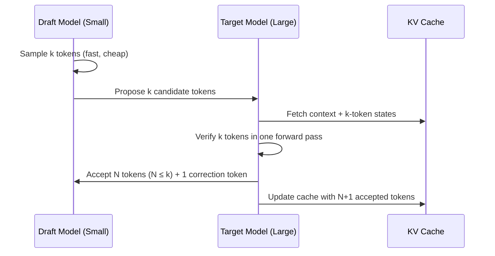

# Chapter 14: Inference and Deployment at Scale

> [!IMPORTANT]
> **What You Will Learn**
> - Distinguish between throughput-bound and memory-bound inference regimes.
> - Master KV cache management: PagedAttention, RadixAttention, prefix caching.
> - Implement the 2026 quantization stack — FP8, GPTQ, AWQ — with quality trade-offs.
> - Achieve 2–3× latency reduction with speculative decoding and Medusa heads.
> - Select the right serving framework for your latency SLA and hardware budget.

---

## Two Inference Regimes

LLM inference operates in two fundamentally different regimes that require different optimization strategies.

| Regime | Bottleneck | When It Occurs | Primary Optimization |
| :--- | :--- | :--- | :--- |
| **Memory-bound** | HBM bandwidth (reading weights) | Single request, short prompt, batch=1 | Quantization reduces weight size; MQA/GQA reduces KV cache reads |
| **Throughput-bound** | Compute (matrix multiplications) | Large batch, high concurrency | Efficient attention, continuous batching, MoE sparse routing |

> [!NOTE]
> The **prefill** phase (processing the prompt) is compute-bound. The **decode** phase (generating tokens one by one) is memory-bound. Modern serving systems treat these phases separately — some frameworks (e.g., Sarathi-Serve) use **chunked prefill** to interleave prefill and decode to improve GPU utilization.

---

## Quantization

Quantization reduces model size and increases throughput by representing weights (and optionally activations) in lower-precision formats.

| Format | Memory Reduction | Throughput vs BF16 | Quality Loss | Best For |
| :--- | :--- | :--- | :--- | :--- |
| BF16 | 1× (baseline) | 1× | None | Training baseline |
| FP8 (W8A8) | 2× | ~1.8× | Minimal | H100/H200 native |
| INT8 (LLM.int8) | ~2× | ~1.5× | Negligible | Serving large models |
| INT4 / GPTQ | ~4× | ~2.5× | Small (0.5–2 pt) | Throughput-optimized |
| INT4 / AWQ | ~4× | ~2.5× | Smaller than GPTQ | Activation-aware |
| GGUF Q4_K_M | ~4.5× | ~2× | Small | Local / edge (CPU/GPU) |
| 1.58-bit BitNet | ~16× | ~5× (custom HW) | Moderate | Research / edge |

### Post-Training Quantization (PTQ) Methods

- **GPTQ (Frantar et al., 2022):** Layer-wise quantization using approximate second-order information (Hessian). Quantizes weights to INT4 with <2% perplexity increase on most models.
- **AWQ (Lin et al., 2023):** Activation-aware weight quantization. Identifies the 1% of weights that matter most for activations and protects them at higher precision. Better quality than GPTQ at the same bit-width.
- **SmoothQuant (Xiao et al., 2022):** Migrates quantization difficulty from activations to weights via a mathematically equivalent per-channel scaling. Enables W8A8 (INT8 weights + INT8 activations) with minimal quality loss.
- **FP8 on H100:** NVIDIA H100/H200 natively supports FP8 matrix multiplication in hardware. `transformer_engine` library handles FP8 training and inference with automatic scaling.

> [!WARNING]
> AWQ and GPTQ quantization require a calibration dataset (~512 samples). The choice of calibration data affects quantization quality. Always evaluate perplexity and downstream benchmarks — never rely on calibration loss alone.

---

## Speculative Decoding

A small **draft model** generates $k$ tokens autoregressively; the large **target model** verifies all $k$ tokens in a single forward pass. Accepted tokens are kept; the first rejected token triggers target-model correction.

**Expected speedup:** 2–3× when draft acceptance rate $\beta > 0.7$.

**Variants:**

| Variant | Draft Source | Key Property |
| :--- | :--- | :--- |
| Standard speculative decoding | Separate small model | Best speedup; requires draft model hosting |
| Medusa | Multiple parallel heads on target model | No separate draft model; simpler deployment |
| EAGLE | Autoregressive draft using target's feature layer | Higher acceptance rate than Medusa |
| Self-speculative | Skipped layers of the same model | Zero extra parameters |
| Prompt lookup decoding | N-gram matches in prompt | Free; works for input-grounded generation |

---

## KV Cache Management

The KV cache stores key/value tensors from previous tokens, enabling reuse across decoding steps. At long contexts, KV cache becomes the primary VRAM bottleneck.

$$\text{KV cache size (bytes)} = 2 \times n_\text{layers} \times n_\text{KV heads} \times d_\text{head} \times L \times \text{bytes per element}$$

For a 70B Llama 3 model (80 layers, 8 KV heads, head dim 128, BF16): ~0.16 GB per 1K tokens.

### PagedAttention (vLLM)

Kwon et al. (2023) adapted OS virtual memory concepts to KV cache:

- Physical KV cache is divided into fixed-size **blocks** (e.g., 16 tokens per block).
- Each request has a **block table** mapping logical to physical blocks.
- Non-contiguous physical blocks eliminate internal and external fragmentation.
- Blocks can be **shared** across requests with the same prefix (prefix caching).

**Result:** 2–4× more concurrent requests at the same VRAM vs. contiguous allocation.

### Prefix Caching and RadixAttention

- **Prefix caching:** Cache KV states for shared system prompts. With a fixed 2K-token system prompt, 100% of requests reuse those KV states — reducing effective compute by 10–20% for typical deployments.
- **RadixAttention (SGLang):** Generalizes prefix caching to a **radix tree** over all possible shared prefixes. Automatically identifies and reuses any shared prefix, not just the system prompt. Achieves 50–80% cache hit rates on multi-turn deployments.

### KV Quantization

Quantize cached KV tensors to INT8 or FP8 to extend effective context within fixed memory:

- INT8 KV quantization: 2× cache size reduction with <0.1% quality degradation on most tasks.
- Supported natively in vLLM and TGI as of 2025.

---

## Continuous Batching

Naive static batching waits for all requests in a batch to finish before accepting new ones — wasteful when requests differ greatly in output length.

**Continuous batching** (Orca, Yu et al., 2022): Insert new requests as slots free up, at the granularity of individual decode steps. Each iteration, the batch contains a mix of requests at different token positions.

```mermaid
gantt
    title Continuous Batching vs Static Batching
    dateFormat X
    axisFormat %s

    section Static Batch
    Req A (short) :done, 0, 3
    Req B (long)  :done, 0, 10
    Req C waits   :crit, 0, 10
    Req C runs    :done, 10, 13

    section Continuous
    Req A (short) :done, 0, 3
    Req C starts  :done, 3, 6
    Req B (long)  :done, 0, 10
```

**Effect:** Near-100% GPU utilization; latency per token is stable regardless of other requests in flight.

---

## Multi-GPU Inference

| Model Size (BF16) | Min VRAM Required | Parallelism Strategy |
| :--- | :--- | :--- |
| 7B | 14 GB | Single A100-40GB |
| 13B | 26 GB | 1× A100-80GB or 2× A100-40GB |
| 70B | 140 GB | 2× A100-80GB (TP=2) or 4× A100-40GB |
| 70B (INT4) | ~35 GB | 1× A100-40GB |
| 405B | ~800 GB | 8× H100-80GB (TP=8) + PP |
| 671B (DeepSeek-V3) | ~1.2 TB | 16× H100-80GB (TP=8, EP=2) |

- **Tensor parallelism (TP):** Split attention heads and FFN columns across GPUs. Requires high-bandwidth interconnect (NVLink). Best within a single node.
- **Pipeline parallelism (PP):** Assign model layers to different GPUs. Tolerates lower interconnect bandwidth; introduces pipeline bubbles.
- **Expert parallelism (EP):** For MoE models, distribute experts across GPUs. Each GPU owns a subset of experts; tokens are routed via all-to-all communication.

---

## Serving Framework Comparison

| Framework | Best For | Key Feature | License |
| :--- | :--- | :--- | :--- |
| **vLLM** | High-throughput cloud serving | PagedAttention, continuous batching | Apache 2.0 |
| **SGLang** | Complex multi-call workflows | RadixAttention, structured generation | Apache 2.0 |
| **TGI (HuggingFace)** | Hugging Face ecosystem | Flash Attention, tensor parallelism | Apache 2.0 |
| **TensorRT-LLM** | Maximum NVIDIA throughput | FP8, CUDA-optimized kernels | Proprietary |
| **llama.cpp / Llamafile** | Local / edge / CPU inference | GGUF quantization, zero dependencies | MIT |
| **Triton Inference Server** | Enterprise multi-model serving | Model ensemble, dynamic batching | BSD |

> [!TIP]
> **Choosing a serving framework:** Start with vLLM for most cloud deployments — it has the broadest model support and the best community benchmarks. Use SGLang if your use case involves structured generation (JSON schemas, multi-step programs). Use TensorRT-LLM only if you have NVIDIA hardware and can afford the compilation overhead for maximum throughput.

---

## Latency Optimization Checklist

- [ ] Enable Flash Attention (FA2 or FA3 on H100)
- [ ] Use GQA/MQA model variants — reduces KV cache bandwidth
- [ ] Enable prefix caching for fixed system prompts
- [ ] Quantize to FP8 (H100) or INT4 (older hardware) if quality loss is acceptable
- [ ] Enable speculative decoding with a draft model or Medusa heads
- [ ] Use continuous batching (all major frameworks support this by default)
- [ ] Profile with `torch.profiler` or nsight to identify the actual bottleneck before optimizing further

---

[← Previous Chapter](ch13_safety.md) | [Table of Contents](../README.md#table-of-contents) | [Next Chapter →](ch15_domain_multimodal.md)
