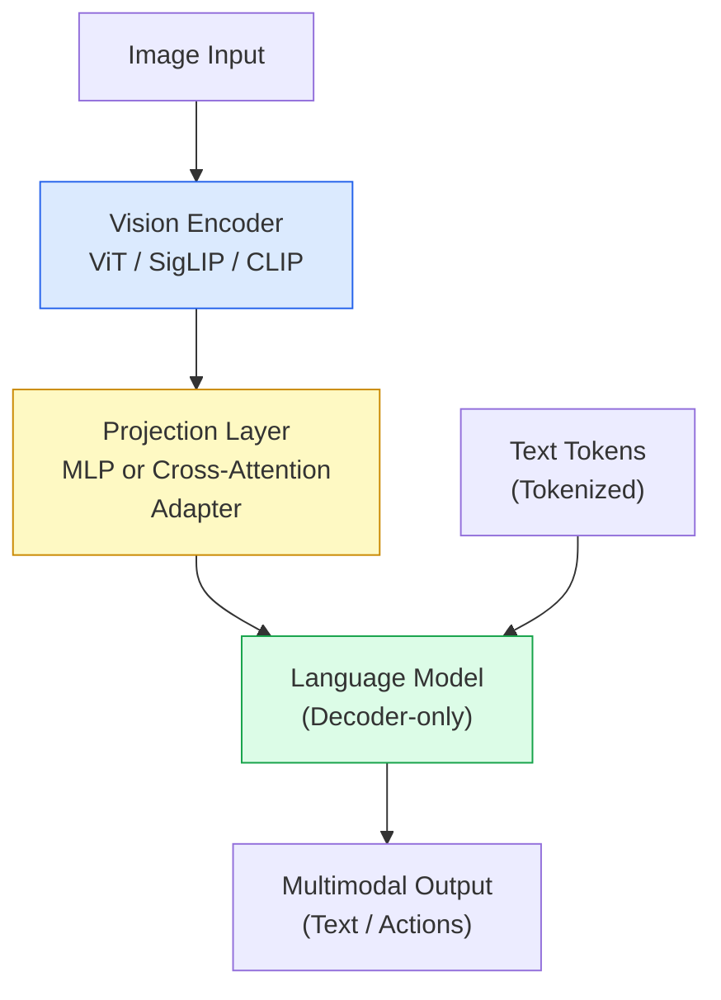
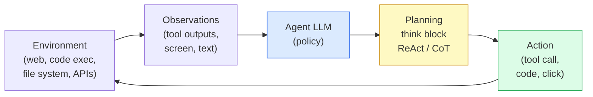
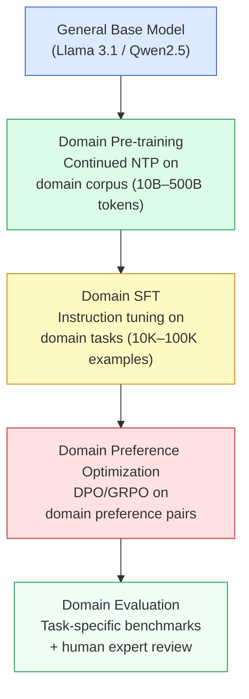

# Chapter 15: Specialized Domains and Multimodality

> [!IMPORTANT]
> **What You Will Learn**
> - Design domain-specific pre-training and fine-tuning pipelines for code, science, law, and finance.
> - Understand the architecture of Vision-Language Models and the shift to early fusion.
> - Implement tool-use SFT and environment-loop RL for agentic AI systems.
> - Evaluate domain-specific and multimodal models using task-appropriate benchmarks.
> - Apply the Small Language Model (SLM) strategy for edge and on-device deployment.

---

## Domain-Specific Pre-training

Domain-specific models consistently outperform general-purpose models on target tasks because domain vocabulary, reasoning patterns, and knowledge structures require exposure during pre-training — fine-tuning alone cannot inject them effectively.

### Domain Model Design Principles

| Decision | Option A | Option B | Recommendation |
| :--- | :--- | :--- | :--- |
| Starting point | Train from scratch | Continue pre-training a general base | Continue pre-training — 10–100× cheaper |
| Domain/general ratio | 100% domain | 50/50 mix | 50/50 preserves generality (BloombergGPT finding) |
| Vocabulary | General tokenizer | Domain-extended tokenizer | Extend for code/science/law (reduces tokenization artifacts) |
| Pre-training objective | NTP only | NTP + domain-specific (FIM for code) | Add domain objectives where available |
| Evaluation | General benchmarks | Domain benchmarks | Domain benchmarks are required signal |

### Notable Domain Models (2024–2026)

| Model | Domain | Training Data | Key Benchmark | Result vs GPT-4 |
| :--- | :--- | :--- | :--- | :--- |
| BloombergGPT (Wu et al., 2023) | Finance | 50% financial + 50% general text | Bloomberg NLP suite | Outperforms; competitive on general |
| Med-PaLM 2 (Singhal et al., 2023) | Medical | Clinical notes, medical literature | USMLE (expert-level) | Expert-level |
| DeepSeek-Coder V2 | Code | 6T code tokens + 4T general | HumanEval, SWE-bench | Top-tier open |
| CodeLlama (Meta) | Code | Code-continued from Llama 2 | HumanEval, MBPP | Strong at 34B |
| Galactica (Meta) | Science | Scientific papers + equations | MMLU STEM | Mixed — failed at general tasks |
| ChatLAW | Legal | Case law, statutes, regulations | Legal QA | Outperforms GPT-3.5 on legal reasoning |

> [!WARNING]
> **Galactica's failure** (retired after 3 days) illustrates domain overfit: training exclusively on scientific text produced a model that confidently hallucinated scientific content. The BloombergGPT 50/50 ratio became the standard recommendation specifically to avoid this failure mode.

---

## Multimodal Models

### Vision-Language Model Architecture

Vision-Language Models (VLMs) combine a vision encoder with a language model. The key architectural decision is how and where visual information is fused with text.

### Fusion Approaches

| Approach | How It Works | Models | Trade-offs |
| :--- | :--- | :--- | :--- |
| **Late fusion (adapter)** | Vision encoder + MLP projector; visual tokens prepended to text sequence | LLaVA-1.5, InstructBLIP | Simple; visual encoder and LLM can be upgraded independently |
| **Cross-attention fusion** | Dedicated cross-attention layers where text attends to visual features | Flamingo, Idefics | More expressive; higher parameter count |
| **Early fusion** | Image patches tokenized and processed jointly with text from layer 1 | Llama 4 Scout/Maverick | Parameter-efficient at scale; longer context required |
| **MoE cross-modal** | Vision and language tokens routed to specialized experts | Qwen-VL | Compute-proportional; best quality per FLOP |

**Vision encoders used in 2026:** SigLIP (Google), CLIP ViT-L/14 (OpenAI), InternViT-6B (Shanghai AI Lab). SigLIP is the 2026 default — trained with sigmoid loss instead of softmax, performs better on multilingual image-text pairs.

### Omni-modal Models

| Modality | Encoding Method | Key Challenge |
| :--- | :--- | :--- |
| Image | ViT patch tokenization | High-resolution scaling (tiling) |
| Video | Frame sampling + temporal encoding | Long video context (10K+ tokens) |
| Audio | Mel spectrogram + audio encoder | Speech vs. non-speech disambiguation |
| Document (PDF) | OCR or native render-to-patch | Multi-page layout understanding |

Models: Gemini 2.5 Pro, GPT-4o, Claude 3.5 Sonnet (vision), Qwen2.5-VL.

---

## Agentic AI

LLMs as agents perceive an environment, plan sequences of actions, call tools, and produce observable effects. Training a frontier agent in 2026 requires three technical layers.

### Layer 1: Tool-Use SFT

The model must learn when to call a tool and how to format the call correctly.

- **Function calling datasets:** Trained on synthetic tool-use traces generated at scale (Berkeley Function Calling Leaderboard, Magpie-generated traces, APIBank).
- **Negative constraint training:** Explicitly train the model to *reject* tool-use for purely conversational requests. Reduces hallucinated tool calls.
- **Tool schema adherence:** JSON schema validation as a training signal — outputs that fail schema validation receive zero reward.

### Layer 2: Planning and Environment-Loop RL

Complex agentic tasks require multi-step planning before execution.

- **ReAct (Yao et al., 2023):** Interleave Reasoning and Acting. The model alternates between `Thought:` (reasoning) and `Action:` (tool call) steps.
- **R1-style think blocks:** Models output a `<think>...</think>` block detailing multi-step strategy before the action.
- **Environment-loop RL:** The model generates an action → receives real tool output → is rewarded for final task completion. Enables learning from execution errors that SFT cannot capture.
- **RLVR with execution feedback:** Reward = 1 if the final answer/artifact is verifiably correct (code passes tests, web task succeeds), 0 otherwise.

### Layer 3: Agentic Evaluation

| Benchmark | Task Type | Difficulty | Key Challenge |
| :--- | :--- | :--- | :--- |
| SWE-bench Verified | GitHub issue resolution | High | Full repo context; requires correct file edits |
| GAIA | Multi-tool web reasoning | High | Requires internet search + reasoning |
| WebArena | Browser automation | Medium | Real browser interactions |
| OSWorld | Desktop GUI tasks | High | Screen understanding + action sequences |
| tau-bench | Retail/airline tool APIs | Medium | Multi-turn with state management |

> [!TIP]
> **Multi-agent architectures:** A single LLM cannot reliably handle all subtasks in complex workflows. The 2026 pattern is a **Manager-Worker hierarchy**: an orchestrator LLM breaks the task into subtasks and delegates to specialized worker agents (coder, searcher, verifier). Workers report back; the manager synthesizes and continues planning.

---

## Small Language Models (SLMs) for Domain-Specific Edge AI

The SLM trend (2024–2026): deploy 1B–7B parameter models on-device or at the edge for low-latency, private, domain-specific inference.

### SLM Characteristics

| Aspect | Target | Techniques |
| :--- | :--- | :--- |
| Parameter count | 1B–7B | Domain-specific pre-training + knowledge distillation |
| Inference hardware | Phone, laptop, embedded MCU | GGUF INT4, MobileLLM, quantization-aware training |
| Latency | <100ms first token | Speculative decoding with n-gram draft |
| Privacy | Data stays on-device | No cloud API calls; local inference only |
| Accuracy | Near-GPT-4 on narrow domain | Deep domain specialization compensates for size |

**Key SLMs in 2026:** Microsoft Phi-4 (3.8B), Apple MLX 3B, Llama 3.2 (1B, 3B), Qwen2.5 (0.5B–7B), Gemma 3 (1B–9B).

---

## Domain Adaptation Workflow

Not every domain requires all four stages. Code: typically continued pre-training + SFT (no DPO needed). Legal/medical: all four stages, with expert annotation for preference data. Edge SLM: distillation from large domain model replaces stages 2–4.

---

[← Previous Chapter](ch14_inference.md) | [Table of Contents](../README.md#table-of-contents) | [Next Chapter →](ch16_model_merging.md)
