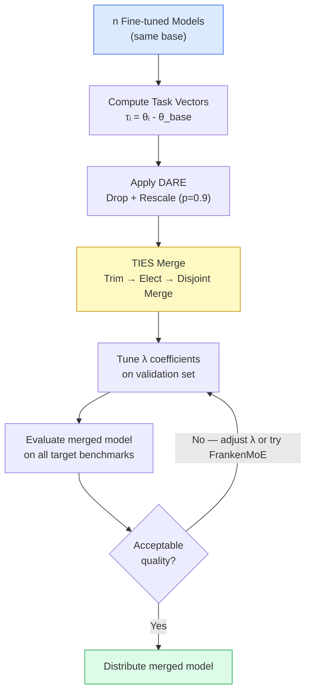

# Chapter 16: Model Merging and Recombination

> [!IMPORTANT]
> **What You Will Learn**
> - Understand task vector arithmetic and how capability addition/subtraction works.
> - Implement SLERP, TIES-Merging, and DARE with correct hyperparameters.
> - Apply DARE to reduce interference when merging models from different fine-tuning runs.
> - Understand FrankenMoE (model souping) and when it outperforms single models.
> - Diagnose and avoid common merging failure modes.

---

## Why Model Merging?

Model merging combines the weights of multiple fine-tuned models without additional training — enabling capability combination at near-zero compute cost. It is the primary mechanism behind many top-ranked open-source models on the Open LLM Leaderboard.

**When merging works:** Models share the same base architecture and tokenizer; fine-tuning tasks are complementary (not competing).

**When merging fails:** Models fine-tuned on conflicting objectives (e.g., one trained to be very verbose, another very concise); models that differ in more than task-vector space (different pre-training).

---

## Task Vectors

Ilharco et al. (2022) formalized **task vectors** as the difference between fine-tuned and base model weights:

$$\tau = \theta_\text{fine-tuned} - \theta_\text{base}$$

Task vectors live in a space where arithmetic corresponds to capability composition:

| Operation | Formula | Effect |
| :--- | :--- | :--- |
| Capability addition | $\theta_\text{base} + \lambda(\tau_A + \tau_B)$ | Combines capabilities A and B |
| Capability subtraction | $\theta_\text{base} - \lambda \tau_\text{toxic}$ | Removes behavior learned during toxic fine-tune |
| Analogy transfer | $\theta_\text{base} + \tau_\text{French} - \tau_\text{English}$ | Adapts a model trained for English tasks to French |
| Multi-task merge | $\theta_\text{base} + \sum_i \lambda_i \tau_i$ | Generalist model from $n$ specialists |

The scaling coefficient $\lambda$ (typically 0.3–1.0) controls how strongly to apply each task vector. Tune on a small validation set.

Full implementations in [Appendix G](app_g_implementation_treasury.md).

---

## Merging Methods

### Linear Interpolation (Weight Averaging)

$$\theta_\text{merged} = (1-\alpha)\,\theta_A + \alpha\,\theta_B$$

Simple but causes **interference**: weights encoding different capabilities can cancel or corrupt each other. Use only when $A$ and $B$ are fine-tuned versions of the same base on similar tasks.

### SLERP (Spherical Linear Interpolation)

Interpolates along the geodesic of the unit hypersphere rather than the straight Euclidean line:

$$\text{SLERP}(\theta_A, \theta_B, t) = \frac{\sin((1-t)\Omega)}{\sin\Omega}\,\theta_A + \frac{\sin(t\Omega)}{\sin\Omega}\,\theta_B$$

where $\Omega = \arccos\!\left(\frac{\theta_A \cdot \theta_B}{\|\theta_A\|\|\theta_B\|}\right)$ is the angle between weight vectors.

SLERP preserves each model's "direction" in weight space better than linear averaging. Standard choice for merging two closely related models (e.g., same model at different checkpoints, or same model fine-tuned on slightly different data).

### TIES-Merging (Yadav et al., 2023)

Addresses sign conflicts — the main failure mode when merging models with different fine-tuning objectives.

**Three steps:**
1. **Trim:** Set small-magnitude task-vector parameters to zero. Only keep the top-$k$% by absolute magnitude.
2. **Elect:** For each parameter, determine the dominant sign across all models' task vectors (majority vote).
3. **Disjoint merge:** Average only the parameters that agree with the elected sign; ignore disagreeing ones.

```python
def ties_merge(base, task_vectors, k=0.2, lambda_=0.5):
    # Step 1: Trim
    trimmed = [trim_top_k(tv, k) for tv in task_vectors]
    # Step 2: Elect sign
    stacked = torch.stack(trimmed)
    sign = torch.sign(stacked.sum(dim=0))
    # Step 3: Disjoint merge — average only agreeing parameters
    mask = torch.stack([(t * sign) > 0 for t in trimmed])
    merged_delta = (stacked * mask).sum(0) / mask.float().sum(0).clamp(min=1)
    return base + lambda_ * merged_delta
```

### DARE (Yu et al., 2023) — Drop And REscale

Randomly drops (zeros out) a fraction $p$ of task-vector parameters and rescales the survivors by $1/(1-p)$:

$$\tau_\text{DARE}[i] = \begin{cases} \tau[i] / (1-p) & \text{with probability } 1-p \\ 0 & \text{with probability } p \end{cases}$$

Intuition: most of the fine-tuning delta is redundant noise; dropping 90% of it and rescaling the rest preserves capability while dramatically reducing interference with other merged models.

**Typical hyperparameters:** $p = 0.9$ (drop 90%), combined with TIES for the merge step.

### Model Breadcrumbs

Remove **outlier parameters** (high-magnitude task-vector values) before merging. Outliers cause disproportionate interference. Threshold: remove parameters where $|\tau[i]| > \mu + 3\sigma$ of the task-vector distribution.

---

## Merging Method Comparison

| Method | Interference Reduction | Quality vs Best Single | Compute Cost | Use When |
| :--- | :--- | :--- | :--- | :--- |
| Linear interpolation | None | May degrade | Trivial | Same-task, same-data variants |
| SLERP | Low | Near best single | Trivial | Two closely related models |
| TIES | High | Often matches best single | Very low | Multiple fine-tunes, different tasks |
| DARE + TIES | Highest | Often exceeds best single | Very low | Many diverse fine-tunes |
| Model Breadcrumbs | Medium | Slightly better than linear | Very low | Pre-processing step before TIES |

---

## FrankenMoE (Model Souping)

**FrankenMoE** assembles experts from different models into a single MoE architecture without training the router from scratch:

1. Take $n$ fine-tuned models sharing the same base architecture.
2. Use the FFN layers of each model as MoE experts.
3. Initialize a router (learned from scratch or zero-shot from embedding similarity).
4. Optional: short fine-tuning pass to tune the router weights.

This is distinct from weight-space merging — FrankenMoE keeps all expert parameters intact and lets the router select. More expressive than any individual expert; inference cost equals one expert's FFN + routing overhead.

> [!TIP]
> **When to use FrankenMoE vs. TIES:** Use TIES when you want a single dense model for deployment simplicity. Use FrankenMoE when you can afford sparse MoE inference overhead and want the best possible quality from existing fine-tunes without retraining.

---

## Practical Merging Workflow



**Tools:** `mergekit` (open source, supports all methods above), Hugging Face `transformers` weight manipulation. `mergekit` config YAML:

```yaml
merge_method: ties
base_model: meta-llama/Llama-3.1-8B
models:
  - model: my-math-ft
    parameters: {weight: 0.5, density: 0.5}
  - model: my-code-ft
    parameters: {weight: 0.5, density: 0.5}
parameters:
  normalize: true
  int8_mask: true
dtype: bfloat16
```

---

## Common Failure Modes

| Symptom | Likely Cause | Fix |
| :--- | :--- | :--- |
| Merged model worse than either source | Sign conflicts between task vectors | Use TIES; add DARE pre-processing |
| Merged model loses one capability entirely | Dominant task vector suppresses smaller one | Increase $\lambda$ for the weaker model |
| Merged model produces incoherent outputs | Models use different chat templates | Ensure both models use identical tokenizer and template |
| Good benchmark scores but bad real-world quality | Merge over-fits to benchmark-aligned fine-tunes | Include a general-purpose model in the merge |
| Regression on safety behaviors | Safety fine-tune task vector overridden | Add safety task vector with high $\lambda$; never subtract it |

---

[← Previous Chapter](ch15_domain_multimodal.md) | [Table of Contents](../README.md#table-of-contents) | [Next Chapter →](ch17_continual_learning.md)
