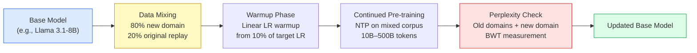

# Chapter 17: Continual Learning and Lifelong Adjustment

> [!IMPORTANT]
> **What You Will Learn**
> - Diagnose catastrophic forgetting and measure it with backward transfer metrics.
> - Apply EWC, LoRA-based updates, and replay to mitigate forgetting.
> - Design a continual pre-training recipe for knowledge injection into a deployed model.
> - Understand the stability-plasticity trade-off and how to tune it for production.
> - Implement LoRA adapter merging as a zero-retraining update strategy.

---

## The Forgetting Problem

When a model is fine-tuned on task B, performance on previously learned task A degrades — sometimes catastrophically. This **catastrophic forgetting** (McCloskey & Cohen, 1989; Kirkpatrick et al., 2017) limits the ability to update deployed models without full retraining.

**Measuring forgetting:** Backward Transfer (BWT) quantifies forgetting across $n$ tasks:

$$\text{BWT} = \frac{1}{n-1}\sum_{i=1}^{n-1}(R_{n,i} - R_{i,i})$$

where $R_{t,i}$ is the performance on task $i$ after training on task $t$. Negative BWT = forgetting; zero = no forgetting; positive = backward transfer (new training helped old tasks).

**Stability-plasticity trade-off:**

| High Stability | High Plasticity |
| :--- | :--- |
| Retains old knowledge well | Learns new tasks quickly |
| Slow to adapt to distribution shifts | Forgets old knowledge |
| Required for: deployed safety behaviors, language quality | Required for: new knowledge domains, new languages |

---

## Mitigation Strategies

### Elastic Weight Consolidation (EWC)

Kirkpatrick et al. (2017) penalize updates to parameters important for previous tasks, identified via the diagonal Fisher information matrix:

$$\mathcal{L}_\text{EWC} = \mathcal{L}_B(\theta) + \frac{\lambda}{2} \sum_i F_i (\theta_i - \theta^*_{A,i})^2$$

where:
- $\mathcal{L}_B$ is the loss on new task B
- $F_i$ is the Fisher information for parameter $i$ (approximated as the squared gradient expectation on task A data)
- $\theta^*_A$ are the optimal parameters for task A
- $\lambda$ controls the forgetting-learning trade-off

**EWC implementation:** See [Appendix G](app_g_implementation_treasury.md) for full PyTorch code.

**Limitation:** EWC stores one full copy of model parameters and a full Fisher matrix per previous task. For large LLMs, this is impractical. Modern practice uses LoRA-based alternatives instead.

### LoRA-Based Updates (Recommended for LLMs)

Fine-tune only low-rank adapter weights; base model weights remain unchanged:

- **No forgetting by design:** Base model weights are frozen — old capabilities are exactly preserved.
- **Task-specific adapters:** Each fine-tuning task gets its own adapter; swap at inference time with zero cost.
- **Adapter merging:** Periodically merge accumulated adapters into the base model using TIES or DARE (see Chapter 16). Produces a single model with multiple capabilities, then repeat with a fresh frozen base.

### Replay-Based Methods

Mix a fraction of old task data into new training:

| Replay Fraction | Forgetting Rate | Compute Overhead | Use Case |
| :--- | :--- | :--- | :--- |
| 0% | High | None | Acceptable only if old tasks are irrelevant |
| 5% | Low | +5% training time | Standard recipe; usually sufficient |
| 20% | Very low | +20% training time | Safety-critical behaviors |
| 50% | Near-zero | +50% training time | Near full multi-task training |

**Replay data selection:** Random sampling is a strong baseline. Importance-weighted replay (select examples with high current-model perplexity on old data) is better but more expensive.

### Hierarchical Optimization (MAML-style)

Meta-learning approaches train a base that can adapt to new tasks in few gradient steps with minimal forgetting. Expensive at training time but effective for few-shot adaptation scenarios.

---

## Continual Pre-training

Updating the **base model** on new data distributions — adding new knowledge, new languages, extending context length:



**Key continual pre-training parameters:**

| Parameter | Recommended Value | Rationale |
| :--- | :--- | :--- |
| Learning rate | 10–30% of original pre-training LR | Smaller LR = less forgetting |
| Warmup steps | 1–2% of total steps | Prevent gradient explosion on new data |
| Replay fraction | 20% original corpus | Preserves general capabilities |
| Batch size | Same as original pre-training | Gradient noise level consistency |
| Schedule | Cosine with short tail | Prevents overfitting to new domain |

---

## Knowledge Injection Methods

| Method | What It Updates | Forgetting Risk | Compute Cost | Best For |
| :--- | :--- | :--- | :--- | :--- |
| Continual pre-training | Base weights | Medium (mitigated by replay) | High | Large knowledge updates (new language, new domain) |
| LoRA fine-tuning | Adapters only | None | Low | Targeted capability addition |
| RAG (retrieval at inference) | Nothing (parametric) | None | Zero training | Rapidly changing knowledge (news, docs) |
| Weight editing (ROME, MEMIT) | Specific factual associations | Low | Very low | Single fact updates (name changes, corrections) |
| Adapter merging | Base weights (via TIES/DARE) | Low | Low | Periodic consolidation of many adapters |

> [!TIP]
> **RAG vs. continual pre-training:** For knowledge that changes frequently (daily news, live product data), RAG is almost always better — no training required and updates are instant. For stable domain knowledge (medical guidelines, legal statutes, programming language specs), continual pre-training injects the knowledge parametrically and removes the retrieval latency at inference time.

---

## Context Length Extension

A special case of continual pre-training: extending a model trained on 4K context to handle 128K+ tokens.

**Recipe:**
1. Start from a model with RoPE positional encoding.
2. Rescale RoPE frequencies using YaRN or LongRoPE (changes base $\theta$ in the rotation formula).
3. Continue pre-training on a mix of long-context documents + 20% original-length replay.
4. Data: concatenated books, code repositories, long-form conversations; avoid short documents during extension.
5. Evaluate on SCROLLS, RULER (needle-in-haystack), and passkey retrieval benchmarks.

**Compute budget:** Context extension typically requires 1–5% of the original pre-training compute.

---

## Production Continual Learning Pattern

The 2026 production pattern for keeping a deployed model current:

```
Deployed Model v1.0
    │
    ├─ Weekly: RAG knowledge base updated (no model change)
    ├─ Monthly: LoRA adapters fine-tuned for reported failure modes
    ├─ Quarterly: Adapter merge → base model v1.1 (TIES/DARE)
    └─ Annually: Full continual pre-training → base model v2.0
```

This tiered approach minimizes training cost while keeping the model current at multiple time scales.

---

[← Previous Chapter](ch16_model_merging.md) | [Table of Contents](../README.md#table-of-contents) | [Next Chapter →](ch18_future.md)
