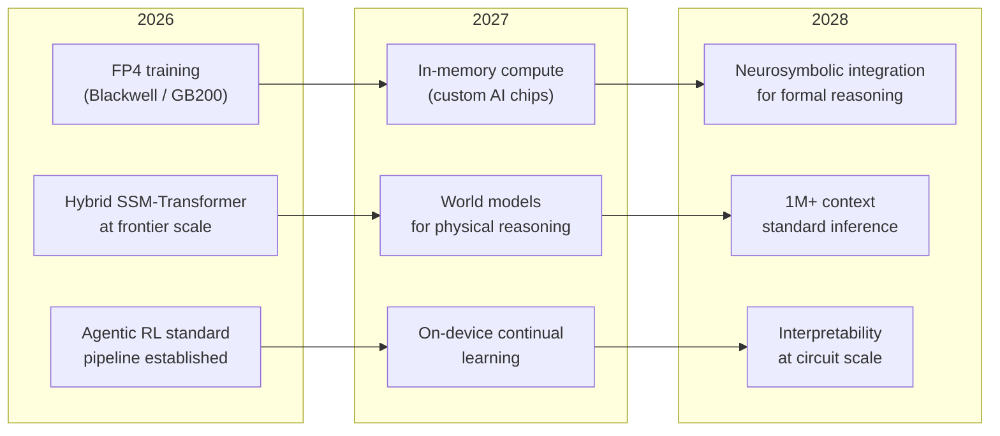

# Chapter 18: The Future of LLM Training

> [!IMPORTANT]
> **What You Will Learn**
> - Identify the six dominant trends shaping LLM development through 2028.
> - Understand why test-time compute scaling is a new axis alongside parameter and data scaling.
> - Analyze the open challenges that no current technique reliably solves.
> - Map the 2026–2028 near-term roadmap: hardware, architectures, and training paradigms.
> - Reflect on the changing role of the engineer in an era of increasingly autonomous AI systems.

---

## Six Dominant Trends (2025–2028)

### 1. Post-Training Is the Primary Differentiator

Pre-training provides a foundation; post-training (SFT + alignment + RL) determines the model's practical utility. The same base model with different post-training pipelines can differ by 20–40 points on instruction-following benchmarks and produce radically different user experiences.

**Evidence:** DeepSeek R1-Zero: 15.6% → 71.0% on AIME purely through RL post-training. Llama 3.1-70B Instruct vs. Base: 20–40 point gap on most instruction benchmarks.

### 2. Test-Time Compute Scaling

A new scaling axis that complements model size and training data:

$$\text{Accuracy}(N, D, T) \approx f(N) + g(D) + h(T)$$

where $T$ is test-time compute (search budget, chain-of-thought length, verifier calls). Models can trade inference cost for accuracy — correct answers emerge from longer thinking, not larger models.

| Test-Time Strategy | Accuracy Gain | Compute Multiplier |
| :--- | :--- | :--- |
| Chain-of-Thought | +10–30 pt on math/code | 2–10× |
| Self-consistency (N=16) | +5–15 pt on reasoning | 16× |
| Best-of-N with verifier | +15–25 pt on math | N× |
| MCTS with PRM | +20–40 pt on competition math | 100–1000× |

### 3. Synthetic Data Dominance

Frontier models generate training data for the next generation. This **data flywheel** creates compounding advantages for labs with strong base models:

- Rejection sampling from a strong teacher generates unlimited high-quality training pairs.
- Math and code verification enables automated quality filtering at scale.
- Self-play generates preference pairs without human annotation.

**Risk:** Synthetic data trained on synthetic data can produce distribution collapse ("model collapse" — Shumailov et al., 2024). Mitigated by maintaining a fraction of real human data in every training mix.

### 4. Efficiency Breakthroughs Compounding

Combined inference efficiency improvements since 2023:

| Technique | Speedup / Cost Reduction |
| :--- | :--- |
| FP8 (H100 native) | 2× vs BF16 |
| Speculative decoding | 2–3× |
| Flash Attention 3 | 1.5–2× vs FA2 |
| Continuous batching | 2–4× throughput |
| INT4 quantization | 4× memory reduction |
| MoE sparse routing | 3–8× parameter efficiency |
| **Combined** | **~50–100× vs 2023 baselines** |

### 5. Open-Source Convergence

Open models (Llama, Qwen, Mistral, DeepSeek) approach closed model performance within 6–12 months of each frontier release. By mid-2026:

- Llama 4 Maverick approaches GPT-4o on most benchmarks at open-weight access.
- DeepSeek R1 matches o1 on math/reasoning while being fully open.
- The performance gap between frontier-closed and top-open is narrowing every quarter.

**Implication for practitioners:** Building on open-weight models is increasingly viable for production — with the added benefit of no API costs, full control, and on-premise deployment.

### 6. Agentic AI as the Next Paradigm

The shift from text-in/text-out to **agent systems** that take real-world actions:

- Models integrate with tools, APIs, code executors, browsers, file systems.
- Multi-agent architectures (orchestrator + specialized workers) solve tasks requiring parallelism and specialization.
- New training paradigm: environment-loop RL with verifiable task completion rewards, not text quality rewards.

---

## Open Challenges

These problems have no reliable solution as of 2026:

| Challenge | Why It Matters | Current Status |
| :--- | :--- | :--- |
| **Data scarcity** | Web text quality has plateaued; synthetic data risks mode collapse | Active research — mixture of real + synthetic; no consensus ratio |
| **Evaluation gaps** | No reliable benchmark for AGI-level tasks, agentic behavior, or long-horizon planning | GAIA, SWE-bench Verified are partial measures; not comprehensive |
| **Safety at scale** | Alignment techniques validated at 7B may not generalize to 1T+ models | Open problem — emergent behaviors are unpredictable |
| **Interpretability** | Cannot reliably predict emergent capabilities or explain failure modes | Mechanistic interpretability progress, but far from production-scale coverage |
| **Energy and compute costs** | Frontier training consumes megawatts; inference at scale requires dedicated data center planning | Hardware efficiency improving, but demand growing faster |
| **Multimodal grounding** | Models that understand the physical world through embodied experience | World models are an active frontier; no clear path to physical grounding from text-only training |
| **Long-horizon planning** | Current agents fail on tasks requiring 100+ coherent sequential decisions | RL + world models show promise; not solved |
| **Legal and regulatory** | EU AI Act, copyright litigation, data provenance requirements growing | Compliance burden increasing; requirements still evolving |

---

## 2026–2028 Near-Term Roadmap

**Hardware:** NVIDIA GB200 NVL72 (2025), Blackwell B300 (2026), and custom AI accelerators (Google TPU v5, AWS Trainium 3) will enable FP4 training and reduce memory bandwidth bottlenecks. In-memory compute (processing-in-memory) will address the von Neumann bottleneck for inference-heavy workloads.

**Architectures:** Hybrid SSM-Transformer models (Jamba, Falcon Mamba) are scaling to frontier size. Native multi-modal architectures (early fusion) become standard. Sub-quadratic attention (based on linear attention + SSM hybrids) may replace Flash Attention for very long contexts.

**Training paradigms:** Agentic RL with real environment feedback becomes a standard post-training stage. Self-improvement loops (model generates data → trains on it → improves → repeat) approach the limits of current safety understanding.

---

## The Changing Role of the Engineer

The 2026 LLM engineer is less concerned with implementing attention mechanisms from scratch and more focused on:

| Old Focus (2020–2023) | New Focus (2024–2028) |
| :--- | :--- |
| Model architecture design | Post-training pipeline design |
| Distributed training infrastructure | Data curation and quality filtering |
| From-scratch implementation | Composition: fine-tuning + merging + distillation |
| Single-model serving | Multi-agent system design |
| Academic benchmark maximization | Production safety and alignment |

> [!NOTE]
> **The meta-skill:** As tooling matures (Hugging Face, vLLM, TRL, mergekit), the highest-leverage skill is **understanding the training pipeline deeply enough to diagnose failures and design experiments**. Engineers who can read a loss curve, interpret benchmark results skeptically, and design a clean ablation study will compound their value faster than those who only use high-level APIs.

---

## Closing Thoughts

The core thesis of this book: **production-ready LLMs are not primarily about scale — they are about alignment, evaluation, and systems engineering.** A 7B model with excellent post-training, robust evaluation, and a well-designed inference stack will outperform a 70B model that skipped those steps on most real-world tasks.

The engineers who will build the most impactful AI systems in 2026–2028 are those who:
- Treat data quality as a first-class engineering problem.
- Build evaluation infrastructure before training infrastructure.
- Think in terms of alignment pipelines, not just loss functions.
- Understand safety as a system property, not a bolt-on filter.
- Stay current with the literature — the field advances faster than any single book can capture.

The techniques in this book represent the frontier as of April 2026. By the time you read this, some will be standard and others will be superseded. But the underlying principles — scale thoughtfully, align carefully, evaluate rigorously — will remain relevant for as long as we are building systems that interact with human users in the real world.

---

[← Previous Chapter](ch17_continual_learning.md) | [Table of Contents](../README.md#table-of-contents) | [Next Chapter →](ch19_company_profiles.md)
